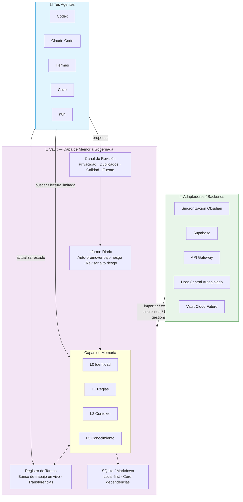

# Memoria de Agente Vault

[English](README.md) | [繁體中文](README.zh-Hant.md) | [简体中文](README.zh-CN.md)

[Sitio web](https://zycaskevin.github.io/Vault-Agent-Memory/es/) · [Desafío Founding 10](https://zycaskevin.github.io/Vault-Agent-Memory/es/challenge/) · [Evidencia en vivo](https://zycaskevin.github.io/Vault-Agent-Memory/es/benchmarks/) · [Reproducir de forma independiente](https://zycaskevin.github.io/Vault-Agent-Memory/es/reproduce/) · [Metodología](https://zycaskevin.github.io/Vault-Agent-Memory/es/benchmarks/methodology/) · [Instalar](#install)

Vault es una capa de gobernanza de memoria local-first, independiente del backend, para agentes de IA.

Vault Agent Memory ofrece a Codex, Claude Code, Hermes, OpenClaw, n8n, Coze y otros agentes una bóveda de memoria gobernada para compartir. No pretende ser otra aplicación de notas ni otra base de datos vectorial. Ayuda a los agentes a decidir qué debe recordarse, quién puede usarlo, si sigue vigente y cómo revertirlo cuando es incorrecto.

El límite del producto Vault es el contrato de gobernanza, no un backend específico. El mismo modelo de revisión basado en candidatos puede ejecutarse en SQLite local, un host central de memoria autoalojado, un adaptador en la nube Supabase o un futuro backend Vault Cloud gestionado.

Vault funciona de forma independiente y también puede convertirse en la capa de memoria gobernada para otros frameworks de memoria de agentes. Puedes usar Vault por sí solo con CLI, MCP, Gateway y SQLite local; o dejar que frameworks como Hermes, OpenClaw, Letta, mem0, Claude Code y Codex se conecten a través de las APIs de Vault mientras Vault mantiene consistentes la revisión, auditoría, ciclo de vida y los límites del backend.

El modelo multiagente central es **compartir en un solo host, sincronización gobernada en múltiples hosts**: los agentes en una máquina de confianza pueden compartir la misma Vault local, mientras que los agentes en otras máquinas o entornos de ejecución alojados pueden leer memoria aprobada y enviar candidatos. Solo un host de sincronización de confianza promueve la memoria oficial, ejecuta trabajos de ciclo de vida y envía copias de lectura revisadas.

El paquete de Python y la ruta de instalación existente permanecen como `vault-for-llm`.

Vault está dirigido a personas que ya están creando o trabajando con agentes. La interfaz principal no debería ser un manual extenso de CLI: pedir a un agente que instale Vault, responder algunas preguntas de configuración y luego leer un breve informe diario de memoria.

¿Nuevo aquí? Comienza con el [sitio web público](https://zycaskevin.github.io/Vault-Agent-Memory/es/). Explica por qué Vault es una base de memoria, no simplemente otro sistema de memoria, y publica evidencia emparejada A vs A + Vault con el método completo y los artefactos sin procesar.

## Madurez del Lanzamiento

Vault Agent Memory v0.10.2 es un lanzamiento de **Beta Pública / Vista previa para desarrolladores**. La ruta local-first está lista para que los desarrolladores de agentes la prueben en proyectos reales, y el modelo multiagente es intencionalmente conservador:

- SQLite/Markdown local permanece como fuente de verdad;
- los agentes en la misma máquina pueden compartir una Vault de confianza;
- los agentes remotos o alojados leen memoria aprobada y envían candidatos;
- solo un host de sincronización de confianza debe poseer credenciales de rol de servicio, promover memoria oficial, ejecutar trabajos de Dream/olvido/archivo y enviar copias de lectura revisadas;
- la búsqueda vectorial central es una capa de lectura derivada sobre resúmenes seguros revisados, no una segunda base de datos de memoria activa.
- los adaptadores de backend pueden cambiar, pero el Contrato de Gobernanza de Vault permanece igual: lecturas aprobadas, envío de candidatos, revisión, promoción, auditoría e informes diarios.

El paquete es pre-1.0. Las superficies avanzadas de Supabase, Gateway, búsqueda vectorial central, automatización y benchmarks son útiles para despliegues de vista previa para desarrolladores, pero deben habilitarse deliberadamente y monitorearse con los informes generados.

El despliegue es intencionalmente por capas:

```text
Agentes / Aplicaciones / Frameworks de Memoria
  -> API de Memoria Vault más adaptadores MCP / Gateway / OpenAPI
  -> Gateway de Vault / Contrato de Gobernanza de Vault
  -> Interfaz del Proveedor de Memoria / Adaptador de Backend
  -> SQLite Local / Host Central Autoalojado / Supabase / Futuro Vault Cloud
```

## Versión en 30 Segundos

Vault Agent Memory existe porque la memoria de agentes falla de formas prácticas:

- una nueva sesión actúa como si se hubiera unido al proyecto desde cero
- las correcciones de errores quedan enterradas en el historial de chat
- las notas antiguas tienen más peso que las decisiones nuevas
- las observaciones privadas se filtran en la memoria compartida del proyecto
- los agentes remotos pueden contaminar la memoria compartida si cada host puede escribir la verdad activa
- los equipos no pueden decir qué memoria fue revisada, confiable o obsoleta



### ¿Por qué Vault?

| Sin Vault | Con Vault |
|---------------|------------|
| Cada agente recuerda por separado, repitiendo los mismos errores | Una bóveda de memoria compartida — aprender una vez, beneficiar en todas partes |
| La información antigua compite con las nuevas decisiones; los agentes no saben qué confiar | Límites temporales + expiración — siempre mostrar la verdad más actual |
| La información sensible se filtra a todas partes; sin pista de auditoría | Metadatos de gobernanza — quién ve qué, rastrear cada cambio, revertir en cualquier momento |
| La memoria es solo un montón de registros de chat, difícil de encontrar señal | Candidato → Revisión → Promoción — solo lo útil permanece |
| Los agentes entre hosts escriben directamente en un almacén compartido | Los agentes remotos envían candidatos; un host de sincronización de confianza revisa y promueve |

El flujo de trabajo central es:

```text
proponer -> revisar -> promover -> buscar -> lectura limitada -> revertir -> auditoría
```

En lenguaje sencillo:

> Vault no se trata de ayudar a los agentes a recordarlo todo. Se trata de ayudar a los equipos a gobernar lo que los agentes recuerdan, confían, comparten, olvidan y revierten.

## ¿Quién Eres? Empieza Aquí 👇

| Rol | Lo que te importa | Punto de partida |
|------|---------------------|----------------|
| 🧑‍💻 Desarrollador de Agentes | ¿Cómo integro Vault en mi agente? | → [Guía de Integración MCP](docs/mcp_memory_workflow.md) |
| 🤖 Usuario Avanzado de Agentes | ¿Cómo evitar que Claude/Codex olvide? | → [Inicio Rápido de 5 Minutos](docs/quickstart.md) · Copia el prompt de instalación a tu agente |
| 👥 Colaboración en Equipo | ¿Cómo comparten memoria múltiples agentes sin caos? | → [Demostración de Memoria Compartida de Tres Agentes](docs/demo/three-agent-shared-memory-runbook.md) |
| 📝 Usuario de Obsidian | ¿Cómo pueden los agentes usar mis notas de forma segura? | → [Integración con Obsidian](#obsidian) |
| 🏗️ Arquitecto / Líder Técnico | ¿Es confiable? ¿Cuál es la arquitectura? | → [Decisiones de Diseño](docs/decision_records/) · [Benchmarks](docs/search_qa_benchmarking.md) |

## Para Constructores de Agentes: Pide a Tu Agente que lo Instale

Copia este prompt en un agente que pueda ejecutar comandos locales:

```text
Instala Vault Agent Memory para este proyecto. Usa vault-for-llm[mcp]==0.10.2.
Usa el modo de memoria gobernada-asistida por agente.

No muestres las banderas avanzadas de CLI primero. Hazme solo cuatro preguntas:
1. ¿Qué idioma debe usar Vault: Chino Tradicional, Chino Simplificado o Inglés?
2. ¿Debe ser una bóveda independiente o una bóveda compartida para múltiples agentes?
3. ¿Debe Vault conectarse a Obsidian, Supabase, ambos o ninguno?
4. ¿A qué hora debe ejecutarse el informe diario de memoria?

Después de la configuración, ejecuta una verificación de funcionamiento y dime:
- dónde vive la bóveda
- cómo leo el informe diario de memoria
- dónde está la interfaz gráfica local o la siguiente acción

Regla diaria:
las memorias seguras, de bajo riesgo y con fuente pueden mantenerse automáticamente;
las memorias inciertas, sensibles, en conflicto o estratégicas deben ir al
informe diario para mi revisión.
```

El agente normalmente ejecutará:

```bash
python3 -m venv .venv
source .venv/bin/activate
pip install "vault-for-llm[mcp]==0.10.2"
vault quickstart
```

También puedes imprimir el prompt de instalación desde Vault mismo:

```bash
vault guide --intent install
```

Para verificar si hay una versión más nueva sin cambiar el entorno:

```bash
vault upgrade --check
```

Vault detecta instalaciones comunes de pip, pipx, uv tool y editable e imprime el comando de actualización apropiado. Este comando de primera etapa es solo de verificación: no instala paquetes ni migra `vault.db`.

`vault quickstart` es el pequeño asistente de primera ejecución. Solo pregunta por el idioma, la memoria independiente/compartida, conexiones opcionales de Obsidian/Supabase y la hora del informe diario. Consulta [docs/quickstart.md](docs/quickstart.md) para el recorrido de 5 minutos y las preguntas frecuentes. Las banderas avanzadas de integración permanecen bajo `vault setup-agent`.

El inicio rápido asistido por agente usa `governed-auto` de forma predeterminada. Internamente, esta sigue siendo la ruta de configuración del consumidor, pero eso no significa que Vault sea una aplicación de consumo de aprendizaje cero. Los candidatos de bajo riesgo y con fuente que pasen las puertas de privacidad, duplicados, metadatos y calidad pueden entrar en la bóveda activa. Las memorias estratégicas, privadas, sensibles, en conflicto o de baja confianza permanecen en el informe diario para revisión humana. Nada se elimina automáticamente de forma permanente.

## Uso Diario

La superficie humana prevista es pequeña:

1. Los agentes proponen lecciones reutilizables mientras trabajan.
2. Vault verifica privacidad, duplicados, calidad y evidencia de la fuente.
3. Las memorias seguras de bajo riesgo pueden entrar en la bóveda.
4. Las decisiones inciertas se resumen en un informe diario.
5. El usuario aprueba, rechaza, pospone o mantiene ambos lados en caso de conflictos.

El informe debe responder:

- ¿Qué recordó Vault hoy?
- ¿Qué pocas decisiones de memoria necesitan mi atención?
- ¿Hay memorias obsoletas, sensibles, en conflicto o de baja calidad para revisar?

Esa es la forma del producto: más automático con el tiempo, pero aún gobernado.

## Lo que Vault No Es

Vault no es un reemplazo de Obsidian.

Obsidian es excelente para que los humanos lean notas. Vault ayuda a los agentes a usar esas notas de forma segura, con rangos de fuente y límites de revisión.

Vault no es solo RAG.

RAG generalmente se enfoca en recuperar contexto. Vault se enfoca en el ciclo de vida de la memoria: quién la escribió, si fue revisada, qué agentes pueden leerla, cuándo deja de ser actual y cómo revertirla.

Vault no es un vertedero de historial de chat sin procesar.

Es basado en candidatos primero. Los agentes pueden sugerir memoria, pero la memoria a largo plazo debe mantenerse respaldada por fuentes, revisable y limpia.

Vault no es un producto de tienda de aplicaciones de configuración cero para personas que no usan agentes.

La primera audiencia pública son los constructores asistidos por agentes: personas que usan Codex, Claude Code, Hermes, OpenClaw, n8n, Coze o sistemas similares que desean una capa de memoria gobernada sin estudiar cada comando interno.

## Cómo se Compara Vault

Vault es complementario a los servicios de memoria y entornos de ejecución de agentes, no un reemplazo directo para todos ellos.

| Categoría de herramienta | Fuerte en | El enfoque diferente de Vault |
|---------------|-----------|-------------------------|
| [Mem0](https://docs.mem0.ai/platform/overview) | APIs de memoria gestionadas, personalización, despliegues en la nube/autoalojados y benchmarks de memoria publicados | Gobernanza local-first, puertas de revisión, reversión, revisión humana diaria y configuración de adaptador multiagente |
| [Letta / MemGPT](https://docs.letta.com/letta-agent) | Una plataforma de agentes con estado con un agente con memoria como prioridad, soñando, habilidades y memoria gestionada por agente | Una capa de memoria gobernada compartida que los agentes existentes pueden usar sin convertirse en un entorno de ejecución de agentes específico |
| Bases de datos vectoriales / pilas RAG | Recuperación rápida sobre incrustaciones y documentos | El ciclo de vida de la memoria alrededor de la recuperación: revisión de candidatos, confianza, sensibilidad, validez temporal, rangos de fuente y pistas de auditoría |
| Notas simples / Obsidian | Trabajo de conocimiento legible por humanos | Acceso seguro para agentes, lecturas limitadas, metadatos de gobernanza, promoción de candidatos y sincronización opcional con Obsidian |

Si necesitas una API de memoria gestionada para una aplicación, Mem0 puede ser el punto de partida más rápido. Si quieres un solo agente con estado que posea su memoria y crezca con el tiempo, Letta puede ser la mejor opción. Si ya usas varios agentes y deseas una base de memoria local, revisable y auditable entre ellos, Vault está diseñado para esa capa.

Esa diferencia importa más entre máquinas: Vault trata a los agentes remotos como lectores de memoria aprobada y remitentes de candidatos, no como escritores directos de la memoria compartida oficial.

## Benchmarks y Verificación

Vault actualmente no reclama una puntuación en el ranking de LoCoMo/LongMemEval.
Esos benchmarks miden la QA de memoria de extremo a extremo y solo deben publicarse para Vault después de ejecutar el mismo banco de pruebas bajo condiciones comparables.
Vault ahora tiene un banco de pruebas de comparación externa de memoria neutral para ejecuciones solo de recuperación en Vault, mem0, Letta y artefactos compatibles; tratar los números actuales como evidencia de recuperación de aciertos de fuente a menos que se incluya explícitamente un lector y juez fijos.

Lo que Vault publica hoy es verificación reproducible para su propio contrato de producto:

- **Search QA**: comprobaciones de aciertos de fuente, MRR, sin resultado y límites de cita para evidencia de recuperación, no calidad de respuesta final.
- **[Benchmark de base de memoria](docs/memory_foundation_benchmarks.md)**:
  evidencia emparejada del motor externo `A` versus motor más Vault `A+B` Valor de Recuperación Válida, exposición prohibida, diferencias de latencia y costo, más una suite de gobernanza dinámica con reloj fijo. La evidencia de contrato sintético se etiqueta por separado de las afirmaciones de producto del proveedor completo. Un paquete VaultGovBench de solo recuperación con cinco repeticiones limpias distintas por pista para recuperación de palabras clave de Vault y inserción en bruto controlada de mem0 2.0.12 se publica en
  [`benchmarks/results/vaultgovbench-retrieval-v0.1/89b9156`](benchmarks/results/vaultgovbench-retrieval-v0.1/89b9156/README.md).
- **Verificación de comandos del README**: los comandos del README público se ejercitan para que los ejemplos de instalación e inicio rápido no se desvíen.
- **Puertas de lanzamiento**: pytest, paridad de lanzamiento, comprobaciones de límite público, comprobaciones de construcción de paquetes y verificación de instalación limpia antes de publicar.
- **Verificación de integración**: rutas locales de MCP/CLI más comprobaciones opcionales de lector alojado de solo lectura de Supabase, Gateway, OpenClaw y Coze cuando esas integraciones forman parte del alcance del lanzamiento.
- **Verificación de sincronización gobernada multihost**: cuando cambian los intercambios remotos, verificar que los agentes anónimos/limitados pueden enviar candidatos pero no pueden escribir memoria activa ni índices derivados, y que el host de sincronización de confianza puede extraer, revisar, promover, informar y enviar copias de lectura aprobadas.

Consulta [Benchmarks de Search QA](docs/search_qa_benchmarking.md) y
[Benchmarks de memoria externa](docs/external_memory_benchmarks.md) para el modelo de evidencia actual de solo recuperación. La
[matriz de afirmaciones del README](docs/readme_claim_matrix.md) rastrea qué afirmaciones públicas son de posicionamiento, comprobaciones de contrato de producto o capacidades de tiempo de ejecución implementadas.

## Demostración Estrella: Memoria Compartida Gobernada

Ejecuta la demostración local:

```bash
vault demo agent-governance --json
```

Simula Codex, Claude Code y Hermes compartiendo una bóveda gobernada:

1. un agente propone una lección de una corrección de error
2. la memoria permanece como candidato hasta que es revisada
3. un revisor la promueve con evidencia de la fuente
4. otro agente la encuentra más tarde con búsqueda y lectura limitada
5. la memoria puede ser declarada obsoleta o revertida cuando queda desactualizada

El paquete de demostración generado también incluye tres guías de seguimiento:
`consumer-mode-demo.md`, `automation-mode-demo.md` y
`multi-host-sync-demo.md`.

Empieza aquí:

- [Los Agentes Necesitan Gobernanza de Memoria, No Solo RAG](docs/articles/agents-need-memory-governance-not-just-rag.md)
- [Manual de tres agentes con memoria compartida](docs/demo/three-agent-shared-memory-runbook.md)
- [Paquete de demostración](docs/demo/agent-governance-demo-pack.md)
- [Documentos de estrategia](docs/strategy/)

## Demostración de 3 Minutos (Próximamente)

> 🎬 *Un GIF de recorrido de 3 minutos estará disponible pronto.*
>
> Mientras tanto, esto es lo que mostrará:
>
> 1. **Instalar** — `pip install vault-for-llm[mcp]` y `vault quickstart`
> 2. **Configurar** — Responder 4 preguntas simples (idioma, tipo de bóveda, integraciones, hora del informe)
> 3. **Proponer** — Un agente sugiere una memoria con `vault_memory_propose`
> 4. **Revisar** — El informe diario muestra candidatos para aprobación humana
> 5. **Promover y Buscar** — La memoria aprobada aparece en `vault_search` con lecturas limitadas
>
> ¿Prefieres un recorrido en texto? → [Inicio Rápido de 5 Minutos](docs/quickstart.md)

## Instalación con Un Clic

### macOS / Linux

```bash
curl -sSL https://raw.githubusercontent.com/zycaskevin/Vault-Agent-Memory/main/scripts/install.sh | bash
```

### Windows (PowerShell)

```powershell
irm https://raw.githubusercontent.com/zycaskevin/Vault-Agent-Memory/main/scripts/install.ps1 | iex
```

Después de que el instalador termine, ejecuta `vault quickstart` para completar la configuración.

Estas URLs sin procesar de GitHub están disponibles desde `main` e instalan la versión de lanzamiento fijada usada por este README. Si prefieres documentación con etiquetas de lanzamiento, usa el próximo lanzamiento que incluya estos scripts de instalador.

Fuente: [`scripts/install.sh`](scripts/install.sh) · [`scripts/install.ps1`](scripts/install.ps1)

## Inicio Rápido para Desarrolladores

```bash
pip install "vault-for-llm[mcp]==0.10.2"

vault init ~/Vaults/demo
vault add "First lesson" \
  --content "The bug was caused by a missing cache key. The fix was adding provider metadata." \
  --project-dir ~/Vaults/demo
vault compile --project-dir ~/Vaults/demo --no-embed
vault search "cache key" --project-dir ~/Vaults/demo
vault --project-dir ~/Vaults/demo map build
vault --project-dir ~/Vaults/demo map read 1 --lines 1-20
vault --project-dir ~/Vaults/demo gui
```

`vault add` toma contenido a través de `--content` o `--file`. Para lecturas de fuente limitadas, usa `vault map read <knowledge_id> --lines INICIO-FIN`.

Para entornos de ejecución con capacidad MCP:

```bash
vault-mcp --project-dir ~/Vaults/demo --tool-profile core
```

Inicia la mayoría de los agentes con `core`:

- `vault_search`
- `vault_read_range`
- `vault_memory_propose`
- `vault_stats`
- `vault_update_status`
- `vault_automation_handoff`

Usa perfiles MCP más grandes solo cuando sea necesario:

| Perfil | Cuándo usarlo |
|---|---|
| `core` | Búsqueda diaria, lecturas limitadas, candidato de memoria, estado, transferencia |
| `review` | Revisión de candidatos, captura, promoción, revisión de Dream |
| `remote` | Lectura de una vista de memoria remota sincronizada |
| `maintenance` | Importación, frescura, convergencia, curación programada |
| `full` | Compatibilidad de usuario avanzado local de confianza |

Documentación MCP detallada:

- [Referencia de herramientas MCP](docs/mcp_tool_reference.md)
- [Flujo de trabajo MCP](docs/mcp_memory_workflow.md)

## Modelo de Memoria

Vault usa L0-L3 para la profundidad de la memoria:

| Capa | Propósito |
|---|---|
| `L0` | identidad y marco del proyecto |
| `L1` | hechos estables, reglas, preferencias |
| `L2` | contexto reciente revisado y resúmenes |
| `L3` | conocimiento detallado, SOPs, errores, decisiones, notas de fuente |

El Registro de Tareas no es L2. Es el banco de trabajo en vivo para bloqueos, próximas acciones, enlaces de evidencia, fechas de vencimiento y notas de transferencia. Solo las lecciones, decisiones y resúmenes duraderos deben promoverse a L2/L3 después de la revisión.

El acceso no está controlado solo por la capa. Usa metadatos de gobernanza:

- `scope`: privado, proyecto, compartido, público
- `sensitivity`: bajo, medio, alto, restringido
- `owner_agent`
- `allowed_agents`
- `memory_type`
- `expires_at`
- `valid_from` / `valid_until`
- `supersedes_id`

Las ventanas de hechos temporales son independientes de la expiración. `expires_at` significa "mover esto fuera del recuerdo normal más adelante." `valid_until` significa "este hecho dejó de ser verdadero, pero mantenerlo para historia y auditoría."

```bash
vault memory temporal status
vault memory temporal list --state past
vault search "office location" --exclude-expired
```

Más detalle: [docs/memory_governance.md](docs/memory_governance.md).

## Automatización e Informes Diarios

La automatización es prioritaria en informes de forma predeterminada. Puede clasificar candidatos, resumir memoria obsoleta, sugerir consolidación y preparar una cola de revisión corta sin sobrescribir silenciosamente la memoria a largo plazo.

```bash
vault daily-report --language en
vault automation brief --pretty
vault automation review-summary --write-summary
vault automation handoff
```

Habilita la automatización más fuerte deliberadamente:

```bash
vault setup-agent \
  --automation-schedule cron \
  --automation-apply \
  --automation-auto-promote-low-risk
```

Esa ruta puede promover solo candidatos de bajo riesgo y con fuente que pasen las puertas normales, con un límite por ejecución. Los candidatos privados, de alta sensibilidad, duplicados, débiles o sin fuente permanecen en revisión.

Documentación de automatización:

- [Automatización](docs/automation.md)
- [Estrategia de automatización](docs/automation_strategy.md)

## Integraciones

| Sistema | Ruta |
|---|---|
| Codex / Claude Code / OpenCode | CLI o MCP stdio local |
| Hermes Agent / OpenClaw | CLI, MCP, archivos de instalación de agente generados |
| n8n | plantillas de flujo de trabajo generadas y adaptadores Gateway/Supabase |
| Coze o agentes alojados | plantillas OpenAPI, Gateway o RPC de lectura Supabase |
| Obsidian | importar notas, exportar memoria revisada, bandeja de entrada de conflictos |
| Otras herramientas de memoria / exportaciones de chat | migración basada en candidatos |
| Headroom | compresión opcional después de que Vault reduce el contexto |

Empieza aquí:

- [Integraciones de agentes](docs/agent_integrations.md)
- [Uso orientado a agentes](docs/agent_first_usage.md)
- [Contrato de Gateway/remoto](docs/decision_records/2026-07-02-vault-remote-gateway-contract.md)

## Obsidian

Importa una bóveda de Obsidian existente:

```bash
vault import obsidian --vault ~/Documents/ObsidianVault --project-dir ~/Vaults/my-project --dry-run
vault import obsidian --vault ~/Documents/ObsidianVault --project-dir ~/Vaults/my-project --compile
```

Exporta el conocimiento de Vault revisado de vuelta a notas legibles por Obsidian:

```bash
vault export obsidian --project-dir ~/Vaults/my-project --vault ~/Documents/ObsidianVault --dry-run --json
vault export obsidian --project-dir ~/Vaults/my-project --vault ~/Documents/ObsidianVault
```

La bandeja de entrada de conflictos usa opciones de resolución explícitas: aceptar Obsidian, aceptar Vault o mantener ambos.

## Modos de Despliegue y Compartición Remota

SQLite local permanece como la fuente de verdad más simple, pero Vault no requiere un backend para siempre. Elige el modo de despliegue que se ajuste al límite de confianza:

| Modo | Mejor para | Costo | Riesgo principal | Recomendación predeterminada |
|---|---|---:|---|---|
| Vault Local | un desarrollador, una máquina | gratis | disciplina de copia de seguridad local | inicio predeterminado |
| Host Central de Memoria Autoalojado | clínicas, equipos, estaciones de trabajo multiagente | solo hardware | VPN/token/copia de seguridad | recomendado para privacidad |
| Adaptador Supabase | agentes alojados, Coze, n8n, sin host siempre activo | posible costo en la nube | configuración RLS/clave/esquema/proveedor | ruta en la nube opcional |
| Vault Cloud | equipos que no desean operar infraestructura de memoria | de pago | confianza del proveedor | backend gestionado futuro |

Las reglas de gobernanza no cambian entre modos: las escrituras remotas entran como candidatos, la memoria aprobada es la superficie de lectura y un revisor de confianza o puerta de política promueve la memoria duradera.

Supabase es un adaptador de nube opcional. Es útil cuando los agentes alojados u otras máquinas necesitan una copia de lectura filtrada y una bandeja de entrada de candidatos sin operar un host central:

```bash
pip install "vault-for-llm[supabase]==0.10.2"
vault remote status --project-dir ~/Vaults/my-project
python -m scripts.sync_to_supabase --db ~/Vaults/my-project/vault.db --document-map --health
```

Gateway / Servidor Remoto es la ruta autoalojada, también llamada el patrón de **Host Central de Memoria Local de Confianza**. Úsalo cuando muchos agentes pueden alcanzar un host central de memoria de confianza:

```bash
# Configura VAULT_GATEWAY_TOKEN desde tu shell o gestor de secretos antes de servir.
vault remote-server health --project-dir ~/Vaults/my-project --json
vault remote-server openapi --project-dir ~/Vaults/my-project --json
vault remote-server serve --project-dir ~/Vaults/my-project --host 0.0.0.0
```

Las contribuciones remotas deben entrar como candidatos de revisión. Esta es una distribución centralizada, no una sincronización multi-master sin conexión. Vault Cloud es el backend gestionado futuro para el mismo Contrato de Gobernanza de Vault; no debe cambiar las semánticas de memoria que usan los despliegues local, autoalojado y Supabase.

El modelo de confianza es:

- **misma máquina**: varios agentes locales pueden compartir un proyecto Vault a través de superficies CLI, MCP, Obsidian o Gateway locales;
- **máquinas diferentes o agentes alojados**: usar credenciales anónimas/limitadas para leer memoria aprobada y enviar candidatos;
- **host de sincronización de confianza**: el único lugar para credenciales de rol de servicio, extracción de candidatos, revisión/promoción, Dream, archivo, olvido, informes, sincronización de copias de lectura aprobadas y actualizaciones de índices vectoriales derivados.

Para memoria multiagente o multidispositivo, usa la superficie de Estación de Memoria Central:

```bash
vault start
vault daily-loop run --write-report --json
vault daily-loop report --refresh --write-report --json
vault memory-sync run-once --push-read-copy --push-central-store --pull-candidates --dry-run --json
vault memory-sync run-once --central-backend self-host --pull-candidates --dry-run --json
vault memory-sync migrate-candidates --direction self-host-to-supabase --json
vault memory-sync export-snapshots --bundle ./vault-snapshots.json --json
vault memory-sync verify-snapshots --bundle ./vault-snapshots.json --json
vault memory-sync import-snapshots --bundle ./vault-snapshots.json --json
vault memory-review inbox --json
vault memory-lifecycle status --json
vault ops security --json
```

`vault daily-loop run` es el orquestador diario: actualiza la frescura de sincronización, la transferencia del ciclo de automatización, la bandeja de entrada, las tarjetas de revisión, la salud de aprendizaje y el informe diario humano en un pase priorizando informes. Usa
`vault daily-loop report --refresh --write-report` cuando solo necesitas reconstruir el último informe del ciclo diario a partir de superficies de estado de solo lectura sin captura ni nuevas escrituras de candidatos. Los comandos detallados de `remote`, `sync`, `dream`, `usage` y `automation` permanecen disponibles como herramientas avanzadas. La superficie central es la entrada de operador más pequeña para despliegues de Supabase o autoalojados.

Documentación:

- [Modos de despliegue](docs/deployment_modes.md)
- [Configuración de Supabase](docs/supabase_setup.md)
- [Política de lectura de Supabase](docs/supabase_read_policy.sql)
- [Base de seguridad de Gateway](docs/decision_records/2026-07-02-gateway-security-foundation.md)
- [Decisión de Estación de Memoria Central](docs/decision_records/2026-07-05-central-memory-station.md)
- [Compartición en un solo host y sincronización gobernada multihost](docs/decision_records/2026-07-08-single-host-multi-host-governed-sync.md)
- [Plan de Estación de Memoria Central](docs/plans/2026-07-05-central-memory-station-development-plan.md)
- [Especificación de Host Central de Memoria Autoalojado](docs/specs/self_host_central_memory_host.md)
- [Revisión de arquitectura de base de memoria](docs/reviews/2026-07-09-memory-foundation-architecture-review.md)

## Migración de Memoria

Importa memoria de otras herramientas como candidatos, no como memoria activa de confianza:

```bash
vault import memory --source ~/Downloads/chatbox-export.json --format auto --dry-run
vault import memory --source ~/Downloads/chatbox-export.json --write-candidates --only summaries,decisions,preferences
```

Los elementos importados pasan por las mismas puertas de privacidad, duplicados, metadatos y calidad.

Para movimientos de backend o un arranque autoalojado, los paquetes de instantáneas revisados pueden mover evidencia de memoria aprobada sin escrituras directas de memoria activa:

```bash
vault memory-sync export-snapshots --bundle ./vault-snapshots.json --json
vault memory-sync export-snapshots --bundle ./vault-snapshots.json --include-content --json
vault memory-sync verify-snapshots --bundle ./vault-snapshots.json --require-content --json
vault memory-sync import-snapshots --bundle ./vault-snapshots.json --apply --json
```

De forma predeterminada, los paquetes de instantáneas excluyen el contenido sin procesar de la memoria. `--include-content`
debe usarse solo a través de una ruta de transferencia confidencial y cifrada. El comando de verificación
comprueba el manifiesto del paquete, el resumen de la instantánea, los hashes de contenido y el estado de contenido faltante sin escribir memoria. La importación aún escribe `memory_candidates` local para revisión; no escribe `knowledge` activa ni promueve memoria.

## Calidad de Recuperación

Vault incluye Search QA para que la recuperación pueda medirse en lugar de confiarse solo a la intuición.

```bash
vault search-qa run \
  --qa-file benchmarks/search_qa/basic.en.json \
  --mode keyword \
  --output /tmp/vault-searchqa.json
```

Las afirmaciones públicas actuales deben leerse como evidencia de recuperación, no calidad de respuesta final:

- las pruebas de incorporación de proyectos encontraron memoria respaldada por fuentes en 28/28 tareas
- las sondas de memoria externa LoCoMo / LongMemEval informan métricas de aciertos de fuente de solo recuperación bajo top-k fijo y coincidencia de ID de fuente
- las puntuaciones oficiales de respondente/juez son independientes y requieren ejecuciones del proveedor de modelos

Más detalle:

- [Benchmark de incorporación de agentes](docs/agent_onboarding_benchmark.md)
- [Benchmarks de Search QA](docs/search_qa_benchmarking.md)
- [Benchmarks de memoria externa](docs/external_memory_benchmarks.md)

## Madurez

| Área | Estado |
|---|---|
| SQLite local, compilación Markdown, búsqueda de palabras clave | estable |
| Configuración CLI, candidato de memoria, lecturas limitadas | usable |
| Herramientas MCP | usable, se recomienda selección de perfil |
| configuración asistida por agente y ciclo diario gobernado-auto | usable, mejorando |
| importación/exportación/conflictos de Obsidian | usable, la UX de sincronización aún mejora |
| sincronización Supabase y Gateway / Servidor Remoto | avanzado opcional |
| búsqueda semántica, proveedores de incrustación, reordenamiento, adaptadores de benchmark | en evolución |
| Agentes de Perfil / Dream / Olvido | orientado a orientación, no eliminación autónoma |

Vault Agent Memory es pre-1.0. La ruta local central es intencionalmente conservadora.
Las rutas remotas y de automatización avanzadas son potentes, pero deben habilitarse deliberadamente.

Limitaciones conocidas para la Beta Pública / Vista previa para desarrolladores:

- Supabase, Gateway y búsqueda semántica central son rutas avanzadas opcionales, no requeridas para la fuente de verdad de Vault local.
- Los agentes remotos no deben recibir claves de rol de servicio; deben usar credenciales anónimas o limitadas para lecturas aprobadas y envío de candidatos.
- la búsqueda semántica remota está deshabilitada de forma predeterminada. Si está habilitada, el proveedor de incrustación de consulta predeterminado es OpenAI, por lo que el texto de la consulta de búsqueda se envía a OpenAI a menos que el operador configure un proveedor de incrustación local o de otra manera confiable.
- Los vectores centrales indexan solo resúmenes seguros revisados y vistas previas; no hacen de Supabase la autoridad de memoria activa.
- Vault Cloud es un backend gestionado futuro para el mismo contrato de gobernanza, no un reemplazo de los modos de despliegue local/autoalojado/Supabase.
- Los resultados de LoCoMo / LongMemEval son sondas de solo recuperación de aciertos de fuente a menos que se publique una ejecución de respondente y juez de QA final explícitamente comparable.
- La automatización es prioritaria en informes y candidatos. Governed-auto puede cerrar el ruido rutinario de revisión de metadatos/deduplicación de bajo riesgo, pero el trabajo estratégico, sensible, de frescura, convergencia y consolidación permanece visible para revisión.

## Mapa de Documentación

- [Conceptos básicos en lenguaje sencillo](docs/core-concepts.md)
- [Modos de despliegue](docs/deployment_modes.md)
- [Manual de instalación de agentes](docs/agent_install.md)
- [Referencia de CLI](docs/cli_reference.md)
- [Integraciones de agentes](docs/agent_integrations.md)
- [Consola GUI local](docs/gui_console.md)
- [Gobernanza de memoria](docs/memory_governance.md)
- [Automatización](docs/automation.md)
- [Referencia de herramientas MCP](docs/mcp_tool_reference.md)
- [Flujo de trabajo MCP](docs/mcp_memory_workflow.md)
- [Integración con LLM](docs/llm_integration.md)
- [Integración OKF](docs/okf_integration.md)
- [Notas de visión](docs/vision.md)

## Desarrollo

Ruta común de Python:

```bash
git clone https://github.com/zycaskevin/Vault-Agent-Memory.git
cd Vault-Agent-Memory
python3 -m venv .venv
source .venv/bin/activate
pip install -e ".[dev,mcp]"
pytest -q
```

Entorno reproducible de Agente/Desarrollador:

```bash
git clone https://github.com/zycaskevin/Vault-Agent-Memory.git
cd Vault-Agent-Memory
uv sync --extra dev --extra mcp
uv run pytest -q
```

`pip install vault-for-llm` permanece como la ruta de instalación de usuario público. El flujo de trabajo de uv es para desarrollo de fuentes, verificaciones de humo de CI y agentes que necesitan reconstruir el mismo entorno local de forma confiable.

## Contribuyendo

Vault está listo para contribuciones pequeñas y acotadas de constructores asistidos por agentes.
Empieza con [CONTRIBUTING.md](CONTRIBUTING.md), las
[ideas de primeros problemas](docs/contributing_good_first_issues.md) y el
[Código de Conducta](CODE_OF_CONDUCT.md). Por favor no incluyas secretos reales,
chats privados, registros de clientes, datos médicos o exportaciones de bóveda de producción en
problemas públicos o solicitudes de extracción.

## Licencia

Apache-2.0. Consulta [LICENSE](LICENSE).
