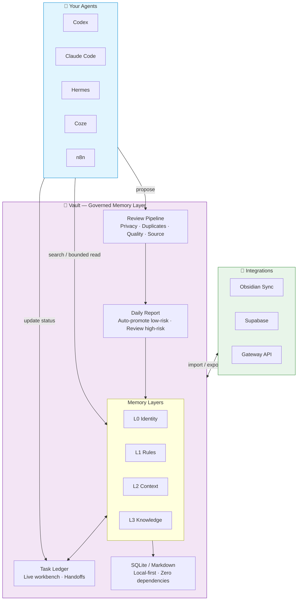

# Vault Agent Memory

[English](README.md) | [繁體中文](README.zh-Hant.md) | [简体中文](README.zh-CN.md)

Local-first memory governance for AI agents.

Vault Agent Memory gives Codex, Claude Code, Hermes, OpenClaw, n8n, Coze, and
other agents one governed memory vault to share. It is not trying to be another
notes app or vector database. It helps agents decide what should be remembered,
who can use it, whether it is still current, and how to roll it back when it is
wrong.

The core multi-agent model is **single-host sharing, multi-host governed sync**:
agents on one trusted machine can share the same local Vault, while agents on
other machines or hosted runtimes can read approved memory and submit
candidates. Only a trusted sync host promotes official memory, runs lifecycle
jobs, and pushes reviewed read copies back out.

The Python package and existing install path remain `vault-for-llm`.

Vault is for people already building or working with agents. The main interface
should still not be a long CLI manual: ask an agent to install Vault, answer a
few setup questions, then read a short daily memory report.

New here? Start with the visual demo:
[`docs/landing/index.html`](docs/landing/index.html).

## 30-Second Version

Vault Agent Memory exists because agent memory fails in practical ways:

- a new session acts like it joined the project on day one
- bug fixes stay buried in chat history
- old notes outrank newer decisions
- private observations leak into shared project memory
- remote agents can pollute shared memory if every host can write active truth
- teams cannot tell which memory was reviewed, trusted, or deprecated



### Why Vault?

| Without Vault | With Vault |
|---------------|------------|
| Each agent remembers separately, repeating the same mistakes | One shared memory vault — learn once, benefit everywhere |
| Old info fights with new decisions; agents don't know what to trust | Temporal boundaries + expiry — always surface the most current truth |
| Sensitive info leaks everywhere; no audit trail | Governance metadata — who sees what, track every change, rollback anytime |
| Memory is just a pile of chat logs, hard to find signal | Candidate → Review → Promote — only what's useful stays |
| Cross-host agents write directly into one shared store | Remote agents submit candidates; a trusted sync host reviews and promotes |

The core workflow is:

```text
propose -> review -> promote -> search -> bounded read -> rollback -> audit
```

In plain language:

> Vault is not about helping agents remember everything. It is about helping
> teams govern what agents remember, trust, share, forget, and roll back.

## Who Are You? Start Here 👇

| Role | What You Care About | Starting Point |
|------|---------------------|----------------|
| 🧑‍💻 Agent Developer | How do I plug Vault into my agent? | → [MCP Integration Guide](docs/mcp_memory_workflow.md) |
| 🤖 Power Agent User | How do I stop Claude/Codex from forgetting? | → [5-Minute Quickstart](docs/quickstart.md) · Copy the install prompt to your agent |
| 👥 Team Collaboration | How do multiple agents share memory without chaos? | → [Three-Agent Shared Memory Demo](docs/demo/three-agent-shared-memory-runbook.md) |
| 📝 Obsidian User | How can agents safely use my notes? | → [Obsidian Integration](#obsidian) |
| 🏗️ Architect / Tech Lead | Is this reliable? What's the architecture? | → [Design Decisions](docs/decision_records/) · [Benchmarks](docs/search_qa_benchmarking.md) |

## For Agent Builders: Ask Your Agent To Install It

Copy this prompt into an agent that can run local commands:

```text
Install Vault Agent Memory for this project. Use vault-for-llm[mcp]==0.8.0.
Use the agent-assisted governed-auto memory mode.

Do not show advanced CLI flags first. Ask me only four questions:
1. Which language should Vault use: Traditional Chinese, Simplified Chinese, or English?
2. Should this be an independent vault or a shared vault for multiple agents?
3. Should Vault connect to Obsidian, Supabase, both, or neither?
4. What time should the daily memory report run?

After setup, run a smoke check and tell me:
- where the vault lives
- how I read the daily memory report
- where the local GUI or next action is

Daily rule:
safe, low-risk, sourced memories can be kept automatically;
uncertain, sensitive, conflicting, or strategic memories should go into the
daily report for my review.
```

The agent will usually run:

```bash
python3 -m venv .venv
source .venv/bin/activate
pip install "vault-for-llm[mcp]==0.8.0"
vault quickstart
```

You can also print the install prompt from Vault itself:

```bash
vault guide --intent install
```

`vault quickstart` is the small first-run wizard. It asks only for language,
independent/shared memory, optional Obsidian/Supabase connections, and daily
report time. See [docs/quickstart.md](docs/quickstart.md) for the 5-minute
walkthrough and FAQ. Advanced integration flags stay under `vault setup-agent`.

Agent-assisted quickstart uses `governed-auto` by default. Internally this is
still the consumer setup path, but that does not mean Vault is a zero-learning
consumer app. Low-risk, sourced candidates that pass privacy, duplicate,
metadata, and quality gates may enter the active vault. Strategy, private,
sensitive, conflicting, or low-trust memories stay in the daily report for
human review. Nothing is hard-deleted automatically.

## Daily Use

The intended human surface is small:

1. Agents propose reusable lessons while they work.
2. Vault checks privacy, duplicates, quality, and source evidence.
3. Safe low-risk memories can enter the vault.
4. Uncertain decisions are summarized in a daily report.
5. The user approves, rejects, defers, or keeps both sides for conflicts.

The report should answer:

- What did Vault remember today?
- What few memory decisions need my attention?
- Are there stale, sensitive, conflicting, or low-quality memories to review?

That is the product shape: more automatic over time, but still governed.

## What Vault Is Not

Vault is not an Obsidian replacement.

Obsidian is great for humans reading notes. Vault helps agents use those notes
safely, with source ranges and review boundaries.

Vault is not just RAG.

RAG usually focuses on retrieving context. Vault focuses on the memory
lifecycle: who wrote it, whether it was reviewed, which agents can read it, when
it stops being current, and how to roll it back.

Vault is not a raw chat-history landfill.

It is candidate-first. Agents can suggest memory, but long-term memory should
stay source-backed, reviewable, and clean.

Vault is not a zero-setup app-store product for people who do not use agents.

The first public audience is agent-assisted builders: people using Codex,
Claude Code, Hermes, OpenClaw, n8n, Coze, or similar systems who want one
governed memory layer without studying every internal command.

## How Vault Compares

Vault is complementary to memory services and agent runtimes, not a drop-in
replacement for all of them.

| Tool category | Strong at | Vault's different focus |
|---------------|-----------|-------------------------|
| [Mem0](https://docs.mem0.ai/platform/overview) | Managed memory APIs, personalization, cloud/self-hosted deployments, and published memory benchmarks | Local-first governance, review gates, rollback, daily human review, and multi-agent adapter setup |
| [Letta / MemGPT](https://docs.letta.com/letta-agent) | A stateful agent platform with a memory-first agent, dreaming, skills, and agent-managed memory | A shared governed memory layer that existing agents can use without becoming one specific agent runtime |
| Vector databases / RAG stacks | Fast retrieval over embeddings and documents | The memory lifecycle around retrieval: candidate review, trust, sensitivity, temporal validity, source ranges, and audit trails |
| Plain notes / Obsidian | Human-readable knowledge work | Agent-safe access, bounded reads, governance metadata, candidate promotion, and optional Obsidian sync |

If you need a managed memory API for an app, Mem0 may be the faster starting
point. If you want a single stateful agent that owns its memory and grows over
time, Letta may be the better fit. If you already use several agents and want a
local, reviewable, auditable memory foundation between them, Vault is designed
for that layer.

That difference matters most across machines: Vault treats remote agents as
approved-memory readers and candidate submitters, not as direct writers to the
official shared memory.

## Benchmarks & Verification

Vault does not currently claim a LoCoMo/LongMemEval-style leaderboard score.
Those benchmarks measure end-to-end memory QA and should only be published for
Vault after running the same benchmark harness under comparable conditions.
Vault now has a neutral external-memory comparison harness for retrieval-only
runs across Vault, mem0, Letta, and compatible run artifacts; treat current
numbers as source-hit evidence recall unless a fixed reader and judge are
explicitly included.

What Vault does publish today is reproducible verification for its own product
contract:

- **Search QA**: source-hit, MRR, no-result, and citation-boundary checks for
  retrieval evidence, not final answer quality.
- **README command smoke**: public README commands are exercised so install and
  quickstart examples do not drift.
- **Release gates**: pytest, release parity, public-boundary checks, package
  build checks, and clean-install smoke before publishing.
- **Integration smoke**: local MCP/CLI paths plus optional Supabase, Gateway,
  OpenClaw, and Coze read-only hosted-reader checks when those integrations are
  part of the release scope.
- **Multi-host governed sync smoke**: when remote sharing changes, verify that
  anon/scoped agents can submit candidates but cannot write active memory or
  derived indexes, and that the trusted sync host can pull, review, promote,
  report, and push approved read copies.

See [Search QA benchmarking](docs/search_qa_benchmarking.md) and
[External memory benchmarks](docs/external_memory_benchmarks.md) for the
current retrieval-only evidence model. The
[README claim matrix](docs/readme_claim_matrix.md) tracks which public claims
are positioning, product-contract checks, or implemented runtime capabilities.

## Killer Demo: Shared Governed Memory

Run the local demo:

```bash
vault demo agent-governance --json
```

It simulates Codex, Claude Code, and Hermes sharing one governed vault:

1. one agent proposes a lesson from a bug fix
2. the memory stays a candidate until reviewed
3. a reviewer promotes it with source evidence
4. another agent finds it later with search and bounded read
5. the memory can be deprecated or rolled back when it becomes outdated

The generated demo pack also includes three follow-up guides:
`consumer-mode-demo.md`, `automation-mode-demo.md`, and
`multi-host-sync-demo.md`.

Start here:

- [Agents Need Memory Governance, Not Just RAG](docs/articles/agents-need-memory-governance-not-just-rag.md)
- [Three-agent shared-memory runbook](docs/demo/three-agent-shared-memory-runbook.md)
- [Demo pack](docs/demo/agent-governance-demo-pack.md)
- [Strategy docs](docs/strategy/)

## 3-Minute Demo (Coming Soon)

> 🎬 *A 3-minute walkthrough GIF is coming soon.*
>
> In the meantime, here's what it will show:
>
> 1. **Install** — `pip install vault-for-llm[mcp]` and `vault quickstart`
> 2. **Configure** — Answer 4 simple questions (language, vault type, integrations, report time)
> 3. **Propose** — An agent suggests a memory with `vault_memory_propose`
> 4. **Review** — The daily report surfaces candidates for human approval
> 5. **Promote & Search** — Approved memory shows up in `vault_search` with bounded reads
>
> Prefer a text walkthrough? → [5-Minute Quickstart](docs/quickstart.md)

## One-Click Install

### macOS / Linux

```bash
curl -sSL https://raw.githubusercontent.com/zycaskevin/Vault-Agent-Memory/main/scripts/install.sh | bash
```

### Windows (PowerShell)

```powershell
irm https://raw.githubusercontent.com/zycaskevin/Vault-Agent-Memory/main/scripts/install.ps1 | iex
```

After the installer finishes, run `vault quickstart` to complete setup.

These raw GitHub URLs are available from `main` and install the pinned release
version used by this README. If you prefer release-tagged documentation, use
the next release that includes these installer scripts.

Source: [`scripts/install.sh`](scripts/install.sh) · [`scripts/install.ps1`](scripts/install.ps1)

## Developer Quickstart

```bash
pip install "vault-for-llm[mcp]==0.8.0"

vault init ~/Vaults/demo
vault add "First lesson" \
  --content "The bug was caused by a missing cache key. The fix was adding provider metadata." \
  --project-dir ~/Vaults/demo
vault compile --project-dir ~/Vaults/demo --no-embed
vault search "cache key" --project-dir ~/Vaults/demo
vault --project-dir ~/Vaults/demo map build
vault --project-dir ~/Vaults/demo map read 1 --lines 1-20
vault --project-dir ~/Vaults/demo gui
```

`vault add` takes content through `--content` or `--file`. For bounded source
reads, use `vault map read <knowledge_id> --lines START-END`.

For MCP-capable runtimes:

```bash
vault-mcp --project-dir ~/Vaults/demo --tool-profile core
```

Start most agents with `core`:

- `vault_search`
- `vault_read_range`
- `vault_memory_propose`
- `vault_stats`
- `vault_update_status`
- `vault_automation_handoff`

Use larger MCP profiles only when needed:

| Profile | Use when |
|---|---|
| `core` | Daily search, bounded reads, candidate memory, status, handoff |
| `review` | Candidate review, capture, promotion, dream review |
| `remote` | Reading a synced remote memory view |
| `maintenance` | Import, freshness, convergence, scheduled curation |
| `full` | Trusted local power-user compatibility |

Detailed MCP docs:

- [MCP tool reference](docs/mcp_tool_reference.md)
- [MCP memory workflow](docs/mcp_memory_workflow.md)

## Memory Model

Vault uses L0-L3 for memory depth:

| Layer | Purpose |
|---|---|
| `L0` | identity and project framing |
| `L1` | stable facts, rules, preferences |
| `L2` | reviewed recent context and summaries |
| `L3` | detailed knowledge, SOPs, bugs, decisions, source notes |

Task Ledger is not L2. It is the live workbench for blockers, next actions,
evidence links, due dates, and handoff notes. Only durable lessons, decisions,
and summaries should be promoted into L2/L3 after review.

Access is not controlled by layer alone. Use governance metadata:

- `scope`: private, project, shared, public
- `sensitivity`: low, medium, high, restricted
- `owner_agent`
- `allowed_agents`
- `memory_type`
- `expires_at`
- `valid_from` / `valid_until`
- `supersedes_id`

Temporal fact windows are separate from expiry. `expires_at` means "move this
out of normal recall later." `valid_until` means "this fact stopped being true,
but keep it for history and audit."

```bash
vault memory temporal status
vault memory temporal list --state past
vault search "office location" --exclude-expired
```

More detail: [docs/memory_governance.md](docs/memory_governance.md).

## Automation And Daily Reports

Automation is report-first by default. It can rank candidates, summarize stale
memory, suggest consolidation, and prepare a short review queue without silently
rewriting long-term memory.

```bash
vault daily-report --language en
vault automation brief --pretty
vault automation review-summary --write-summary
vault automation handoff
```

Enable stronger automation deliberately:

```bash
vault setup-agent \
  --automation-schedule cron \
  --automation-apply \
  --automation-auto-promote-low-risk
```

That path can promote only low-risk, sourced candidates that pass the normal
gates, with a per-run cap. Private, high-sensitivity, duplicate, weak, or
sourceless candidates stay in review.

Automation docs:

- [Automation](docs/automation.md)
- [Automation strategy](docs/automation_strategy.md)

## Integrations

| System | Path |
|---|---|
| Codex / Claude Code / OpenCode | CLI or local stdio MCP |
| Hermes Agent / OpenClaw | CLI, MCP, generated agent install files |
| n8n | generated workflow templates and Gateway/Supabase adapters |
| Coze or hosted agents | OpenAPI templates, Gateway, or Supabase read RPC |
| Obsidian | import notes, export reviewed memory, conflict inbox |
| Other memory tools / chat exports | candidate-first migration |
| Headroom | optional compression after Vault narrows context |

Start here:

- [Agent integrations](docs/agent_integrations.md)
- [Agent-first usage](docs/agent_first_usage.md)
- [Gateway / remote contract](docs/decision_records/2026-07-02-vault-remote-gateway-contract.md)

## Obsidian

Import an existing Obsidian vault:

```bash
vault import obsidian --vault ~/Documents/ObsidianVault --project-dir ~/Vaults/my-project --dry-run
vault import obsidian --vault ~/Documents/ObsidianVault --project-dir ~/Vaults/my-project --compile
```

Export reviewed Vault knowledge back into Obsidian-readable notes:

```bash
vault export obsidian --project-dir ~/Vaults/my-project --vault ~/Documents/ObsidianVault --dry-run --json
vault export obsidian --project-dir ~/Vaults/my-project --vault ~/Documents/ObsidianVault
```

The conflict inbox uses explicit resolver choices: accept Obsidian, accept
Vault, or keep both.

## Remote Sharing

Local SQLite remains the simplest source of truth. For remote sharing, choose
the adapter that fits the deployment.

Supabase is useful when hosted agents or other machines need a filtered read
copy:

```bash
pip install "vault-for-llm[supabase]==0.8.0"
vault remote status --project-dir ~/Vaults/my-project
python -m scripts.sync_to_supabase --db ~/Vaults/my-project/vault.db --document-map --health
```

Gateway / Remote Server is useful when many agents can reach one trusted
self-hosted endpoint:

```bash
export VAULT_GATEWAY_TOKEN="choose-a-stable-secret"
vault remote-server health --project-dir ~/Vaults/my-project --json
vault remote-server openapi --project-dir ~/Vaults/my-project --json
vault remote-server serve --project-dir ~/Vaults/my-project --host 0.0.0.0
```

Remote contributions should enter as review candidates. This is centralized
sharing, not offline multi-master sync.

The trust model is:

- **same machine**: several local agents can share one Vault project through
  local CLI, MCP, Obsidian, or Gateway surfaces;
- **different machines or hosted agents**: use anon/scoped credentials to read
  approved memory and submit candidates;
- **trusted sync host**: the only place for service-role credentials, candidate
  pull, review/promotion, Dream, archive, forgetting, reports, approved
  read-copy sync, and derived vector-index updates.

For multi-agent or multi-device memory, use the Central Memory Station surface:

```bash
vault start
vault daily-loop run --write-report --json
vault daily-loop report --refresh --write-report --json
vault memory-sync run-once --push-read-copy --push-central-store --pull-candidates --dry-run --json
vault memory-sync run-once --central-backend self-host --pull-candidates --dry-run --json
vault memory-review inbox --json
vault memory-lifecycle status --json
vault ops security --json
```

`vault daily-loop run` is the daily orchestrator: it refreshes sync freshness,
automation cycle handoff, inbox, review cards, learning health, and the human
daily report in one report-first pass. Use
`vault daily-loop report --refresh --write-report` when you only need to rebuild
the latest daily-loop report from read-only status surfaces without capture or
new candidate writes. The detailed `remote`, `sync`, `dream`, `usage`, and
`automation` commands stay available as advanced tools. The central surface is
the smaller operator entry for Supabase or self-hosted deployments.

Docs:

- [Supabase setup](docs/supabase_setup.md)
- [Supabase read policy](docs/supabase_read_policy.sql)
- [Gateway security foundation](docs/decision_records/2026-07-02-gateway-security-foundation.md)
- [Central Memory Station decision](docs/decision_records/2026-07-05-central-memory-station.md)
- [Single-host sharing and multi-host governed sync](docs/decision_records/2026-07-08-single-host-multi-host-governed-sync.md)
- [Central Memory Station plan](docs/plans/2026-07-05-central-memory-station-development-plan.md)

## Memory Migration

Import memory from other tools as candidates, not as trusted active memory:

```bash
vault import memory --source ~/Downloads/chatbox-export.json --format auto --dry-run
vault import memory --source ~/Downloads/chatbox-export.json --write-candidates --only summaries,decisions,preferences
```

Imported items pass the same privacy, duplicate, metadata, and quality gates.

## Retrieval Quality

Vault includes Search QA so retrieval can be measured instead of trusted by
intuition alone.

```bash
vault search-qa run \
  --qa-file benchmarks/search_qa/basic.en.json \
  --mode keyword \
  --output /tmp/vault-searchqa.json
```

Current public claims should be read as retrieval evidence, not final answer
quality:

- project onboarding proof runs found source-backed memory across 28/28 tasks
- LoCoMo / LongMemEval external-memory probes report retrieval-only source-hit
  metrics under fixed top-k and source-id matching
- official answerer/judge scores are separate and require model-provider runs

More detail:

- [Agent onboarding benchmark](docs/agent_onboarding_benchmark.md)
- [Search QA benchmarking](docs/search_qa_benchmarking.md)
- [External memory benchmarks](docs/external_memory_benchmarks.md)

## Maturity

| Area | Status |
|---|---|
| local SQLite, Markdown compile, keyword search | stable |
| CLI setup, candidate memory, bounded reads | usable |
| MCP tools | usable, profile selection recommended |
| agent-assisted setup and governed-auto daily loop | usable, improving |
| Obsidian import/export/conflict inbox | usable, sync UX still improving |
| Supabase sync and Gateway / Remote Server | advanced optional |
| semantic search, embedding providers, rerank, benchmark adapters | evolving |
| Profile / Dream / Forgetting agents | guidance-first, not autonomous deletion |

Vault Agent Memory is pre-1.0. The core local path is intentionally conservative.
Advanced remote and automation paths are powerful, but should be enabled
deliberately.

## Documentation Map

- [Core concepts in plain language](docs/core-concepts.md)
- [Agent install runbook](docs/agent_install.md)
- [CLI reference](docs/cli_reference.md)
- [Agent integrations](docs/agent_integrations.md)
- [Local GUI console](docs/gui_console.md)
- [Memory governance](docs/memory_governance.md)
- [Automation](docs/automation.md)
- [MCP tool reference](docs/mcp_tool_reference.md)
- [MCP workflow](docs/mcp_memory_workflow.md)
- [LLM integration](docs/llm_integration.md)
- [OKF integration](docs/okf_integration.md)
- [Vision notes](docs/vision.md)

## Development

Common Python path:

```bash
git clone https://github.com/zycaskevin/Vault-Agent-Memory.git
cd Vault-Agent-Memory
python3 -m venv .venv
source .venv/bin/activate
pip install -e ".[dev,mcp]"
pytest -q
```

Reproducible Agent/developer environment:

```bash
git clone https://github.com/zycaskevin/Vault-Agent-Memory.git
cd Vault-Agent-Memory
uv sync --extra dev --extra mcp
uv run pytest -q
```

`pip install vault-for-llm` remains the public user install path. The uv workflow
is for source development, CI smoke checks, and agents that need to rebuild the
same local environment reliably.

## Contributing

Vault is ready for small, bounded contributions from Agent-assisted builders.
Start with [CONTRIBUTING.md](CONTRIBUTING.md), the
[good first issue ideas](docs/contributing_good_first_issues.md), and the
[Code of Conduct](CODE_OF_CONDUCT.md). Please do not include real secrets,
private chats, customer records, medical data, or production vault exports in
public issues or pull requests.

## License

Apache-2.0. See [LICENSE](LICENSE).
