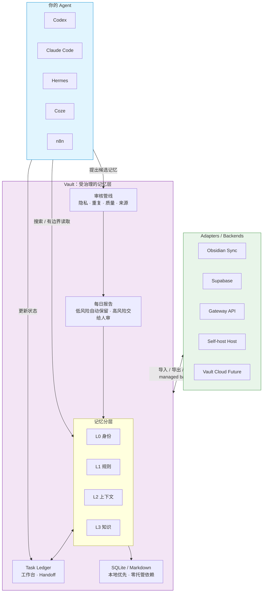

# Vault Agent Memory

[English](README.md) | [繁體中文](README.zh-Hant.md) | [简体中文](README.zh-CN.md)

[官方网站](https://zycaskevin.github.io/Vault-Agent-Memory/) · [Founding 10 挑战](https://zycaskevin.github.io/Vault-Agent-Memory/challenge/) · [公开测试](https://zycaskevin.github.io/Vault-Agent-Memory/benchmarks/) · [第三方独立复现](https://zycaskevin.github.io/Vault-Agent-Memory/reproduce/) · [测试方法](https://zycaskevin.github.io/Vault-Agent-Memory/benchmarks/methodology/)

给 AI Agent 用的本地优先、后端无关记忆治理层。

它让 Codex、Claude Code、Hermes、OpenClaw、n8n、Coze 等不同 Agent，
可以使用同一套项目记忆，而不是每次换工具就重新交代背景。

Vault 的产品边界是治理合约，不是某个特定后端。同一套 candidate-first 流程
可以跑在 local SQLite、自架中央记忆主机、Supabase cloud adapter，或未来
Vault Cloud。

Vault 可以单独当记忆库用，也可以成为其他 Agent / memory framework 背后的
受治理记忆后端。你可以只用 CLI、MCP、Gateway 和本机 SQLite；也可以让
Hermes、OpenClaw、Letta、mem0、Claude Code、Codex 这类框架透过 Vault API
接进来，由 Vault 统一守住审查、审计、生命周期与后端边界。

它最重要的多 Agent 模型是：**单机共享，多机治理同步**。同一台可信主机上的
Agent 可以共用一份本地 Vault；不同主机或 hosted Agent 只能读取已批准记忆、
提交候选记忆。正式记忆、做梦、归档、遗忘、回滚与同步，仍由 trusted sync
host 负责。

Vault 不是给完全没接触 Agent 的大众 app。它先服务已经在用
Codex、Claude Code、Hermes、OpenClaw、n8n、Coze 这类工具的 builder。

你仍然不需要先学一堆命令。最简单的用法是：把下面那段话贴给你的
Agent，让它帮你安装、设置、测试，之后你每天只看一份很短的记忆报告。

第一次看这个项目，可以先打开视觉 Demo：
[`docs/landing/index.html`](docs/landing/index.html)。

## 30 秒版

Vault Agent Memory 解决的不是“把更多东西塞进 AI”。

它解决的是：

- Agent 修过的 bug，下次不要再重踩。
- 项目决策有来源，不要散在聊天记录里。
- 多个 Agent 可以共享工作知识，但私人记忆不乱流。
- 新记忆先进入候选区，安全、低风险的才自动进入正式记忆。
- 不确定、敏感、冲突的内容，每天整理成报告让人确认。
- 跨主机 Agent 可以投稿，但不能直接污染正式共享记忆。

一句话：

> Vault Agent Memory 不是让 Agent 什么都记住，而是让 Agent 可信地记、可审查地记、需要时能回滚。



### 为什么要用 Vault？

| 没有 Vault | 有 Vault |
|---|---|
| 每个 Agent 各记各的，同一个错误一直重演 | 一个共享记忆库，一次学到，多个 Agent 都能用 |
| 旧信息和新决策混在一起，Agent 不知道该信谁 | 有时间边界与过期机制，优先浮出最新可信内容 |
| 敏感信息到处流，没有审计与回滚 | 用治理 metadata 管 scope、sensitivity、owner、allowed agents |
| 记忆只是聊天记录堆，信号很难找 | 候选 → 审核 → 提升，只留下值得长期使用的记忆 |
| 不同主机的 Agent 都能直接写中央记忆 | 远端 Agent 只能提交候选，由 trusted sync host 审核后提升 |

核心流程：

```text
propose -> review -> promote -> search -> bounded read -> rollback -> audit
```

## 你是哪种用户？先从这里开始

| 角色 | 你在意的事 | 起点 |
|---|---|---|
| Agent 开发者 | 要怎么把 Vault 接进自己的 Agent？ | [MCP 记忆工作流](docs/mcp_memory_workflow.md) |
| 重度 Agent 用户 | 怎么让 Claude/Codex 不要一直忘？ | [5 分钟 Quickstart](docs/quickstart.md)，或直接复制下面的安装话术 |
| 团队协作 | 多个 Agent 怎么共享记忆但不失控？ | [三 Agent 共享记忆 runbook](docs/demo/three-agent-shared-memory-runbook.md) |
| Obsidian 用户 | 怎么让 Agent 安全使用我的笔记？ | [Obsidian](#obsidian) |
| 架构 / 技术负责人 | 这套东西可靠吗？边界在哪？ | [决策记录](docs/decision_records/) 与 [Search QA](docs/search_qa_benchmarking.md) |

## 最推荐：让 Agent 帮你安装

把这段贴给能执行本机命令的 Agent：

```text
帮这个项目安装 Vault Agent Memory。使用 vault-for-llm[mcp]==0.10.2。
请用 agent-assisted 的 governed-auto 记忆模式。

不要先显示进阶 CLI 参数。只问我四件事：
1. 我要用繁体中文、简体中文，还是英文？
2. 这个 Vault 是独立记忆库，还是给多个 Agent 共用？
3. 要不要连接 Obsidian 或 Supabase？
4. 每天几点给我记忆报告？

安装后请做一次 smoke check，并告诉我：
- Vault 放在哪里
- 每日记忆报告怎么看
- 本地 GUI 或下一步入口在哪里

日常规则：
安全、低风险、有来源的记忆可以自动保留；
不确定、敏感、冲突、策略性的记忆放进每日报告让我审核。
```

如果你是开发者，也可以手动执行：

```bash
python3 -m venv .venv
source .venv/bin/activate
pip install "vault-for-llm[mcp]==0.10.2"
vault quickstart
```

也可以让 Vault 打印可复制给 Agent 的安装话术：

```bash
vault guide --intent install
```

## 每天怎么用

已经在用 Agent 的 builder，不应该每天为了记忆库打命令。理想流程是：

1. Agent 工作时，会把“可能值得记住的事”提出来。
2. Vault 先检查隐私、重复、质量和来源。
3. 安全、低风险、有来源的记忆可以自动进入正式 Vault。
4. 需要你判断的内容，整理成每日记忆报告。
5. 你只看很少几张卡片：接受、拒绝、延后或保留两份。

每日报告应该回答三件事：

- 今天 Vault 帮我记住了什么？
- 有哪些记忆需要我看一眼？
- 有没有冲突、过期、敏感或不该长期保存的内容？

这就是 Vault 的核心路线：Agent 可以越来越会整理，但人保留最后的审核权。

## 适合谁

Vault Agent Memory 适合：

- 用 Codex、Claude Code、Hermes、OpenClaw、OpenCode、n8n 或 Coze 做项目的人。
- 希望多个 Agent 共用同一套项目记忆的人。
- 已经有 Markdown 或 Obsidian 笔记，希望 Agent 能查、能引用的人。
- 想把记忆留在自己手上，而不是一开始就交给云端的人。
- 想知道 Agent 到底根据哪份文件回答，而不是只相信它“好像记得”的人。

如果你只想要普通笔记软件、纯向量数据库，或完全黑盒的聊天记忆产品，
Vault Agent Memory 可能不是第一个该拿起来的工具。

如果你完全没有使用 Agent 的习惯，也不想让 Agent 帮你安装或管理工具，
Vault 现在还不是 app-store 式的一键产品。它目前最适合的是：已经踏入
Agent 工作流，但希望记忆不要分散、不要污染、不要失控的人。

## 它不是什么

它不是 Obsidian 替代品。

Obsidian 很适合人看笔记；Vault 让 Agent 能安全地使用那些笔记。

它不是单纯 RAG。

RAG 通常只管“查得到”。Vault 更在意“谁写的、能不能信、是否过期、谁能读、错了能不能回滚”。

它也不是聊天记录垃圾桶。

Vault 不鼓励把所有对话原封不动塞进长期记忆。它鼓励候选制、日报审核和低风险自动入库。

## 跟其他记忆工具怎么比

Vault 比较像补在既有 Agent 之间的“记忆治理层”，不是要取代所有记忆服务或
Agent runtime。

| 工具类型 | 强项 | Vault 不同的重点 |
|----------|------|------------------|
| [Mem0](https://docs.mem0.ai/platform/overview) | Managed memory API、个性化、cloud/self-hosted 部署、公开记忆 benchmark | Local-first governance、审核关卡、rollback、每日人工 review、多 Agent adapter setup |
| [Letta / MemGPT](https://docs.letta.com/letta-agent) | Stateful agent platform、memory-first agent、dreaming、skills、Agent 自主管理记忆 | 让既有 Codex、OpenClaw、Claude、Coze、n8n 等 Agent 共用同一个受治理记忆层 |
| Vector DB / RAG stack | 快速查 embeddings 和文档 | 管理 retrieval 前后的生命周期：候选、信任度、敏感度、时效、来源范围、audit |
| 一般笔记 / Obsidian | 人类阅读与知识整理 | Agent-safe access、bounded read、治理 metadata、候选提升、可选 Obsidian sync |

如果你要的是 app 内可快速接上的 managed memory API，Mem0 可能更快。如果你要的是
一个会长期存在、自己成长的单一 Agent，Letta 可能更合适。如果你已经在用多个
Agent，想让它们共用一份本地优先、可审核、可回滚的记忆地基，Vault 的定位就在这里。

这个差异在跨主机时最明显：Vault 把远端 Agent 视为“已批准记忆的读者”和
“候选记忆的投稿者”，不是正式中央记忆的直接写入者。

## Benchmark 与验证

Vault 目前不宣称自己有 LoCoMo / LongMemEval 类 leaderboard 分数。这类 benchmark
衡量的是 end-to-end memory QA，只有在同一套 harness、同等条件跑过后才适合公开比较。

Vault 现在公开的是可重现的产品契约验证：

- **Search QA**：source hit、MRR、no-result、citation boundary；衡量 retrieval evidence，不是 final answer 品质。
- **[记忆地基 benchmark](docs/memory_foundation_benchmarks.md)**：在同一 frozen candidate pool
  比较外部引擎 `A` 与引擎加 Vault `A+B` 的 Valid Recall、forbidden exposure、latency、cost，
  并运行 fixed-clock 动态治理 suite；synthetic contract data 不混充 live provider 成绩。
- **README command smoke**：确认 README 里的公开命令没有漂移。
- **Release gates**：pytest、release parity、public-boundary checks、package build checks、clean-install smoke。
- **Integration smoke**：依 release scope 验证 MCP/CLI、本地路径，以及可选的 Supabase、Gateway、OpenClaw、Coze read-only hosted reader。
- **Multi-host governed sync smoke**：远端共享有变更时，验证 anon/scoped Agent 可以提交候选，
  但不能写 active memory 或 derived index；trusted sync host 可以 pull、review、promote、
  产报告，并推送 approved read copy。

目前 evidence model 见 [Search QA benchmarking](docs/search_qa_benchmarking.md) 和
[README claim matrix](docs/readme_claim_matrix.md)。

## 三个常见场景

### 1. 多个 Agent 共用项目记忆

Claude Code 修过一个测试流程，Codex 下一次可以查到；Hermes 可以看到已审核的决策；
OpenClaw 可以读共享 SOP，但不能读私人原始对话。

这是 Vault 最重要的方向：一个记忆库，多个 Agent 使用，各自有权限边界。

### 2. Obsidian 变成 Agent 可用的知识入口

你可以把既有 Obsidian 笔记导入 Vault，或让 Vault 把正式记忆导出成 Obsidian 可读格式。

目标不是把 Obsidian 变成数据库，而是让人的笔记和 Agent 的记忆能互相看见。

### 3. 多台机器或 hosted Agent 读共享记忆

本地 SQLite 仍是最简单、最可控的起点。

如果你需要跨主机共享，可以选 Supabase 或 Vault Gateway / Remote Server。
Vault 的设计方向是 adapter-first：同步层可以换，但统一记忆层要保持稳定。

### 实际 Demo 路线

想先看完整闭环，可以跑本地 demo：

```bash
vault demo agent-governance --json
```

它会模拟 Codex、Claude Code、Hermes 共用同一个受治理的 Vault：

1. 一个 Agent 从 bug fix 提出候选记忆。
2. 记忆先停在候选区，不直接影响搜索。
3. Reviewer 带着来源证据把它提升成正式记忆。
4. 另一个 Agent 之后用 search + bounded read 找回这段记忆。
5. 记忆过期或错误时，可以 deprecated 或 rollback。

延伸阅读：

- [Agents Need Memory Governance, Not Just RAG](docs/articles/agents-need-memory-governance-not-just-rag.md)
- [三 Agent 共享记忆 runbook](docs/demo/three-agent-shared-memory-runbook.md)
- [Demo pack](docs/demo/agent-governance-demo-pack.md)
- [Strategy docs](docs/strategy/)

## 一键安装

### macOS / Linux

```bash
curl -sSL https://raw.githubusercontent.com/zycaskevin/Vault-Agent-Memory/main/scripts/install.sh | bash
```

### Windows PowerShell

```powershell
irm https://raw.githubusercontent.com/zycaskevin/Vault-Agent-Memory/main/scripts/install.ps1 | iex
```

安装完成后，执行 `vault quickstart` 完成设置。

这两个 raw GitHub URL 已经可以从 `main` 使用，并会安装本 README 固定的
release 版本。如果你想完全按照 release-tagged 文档走，请使用包含这两支
安装脚本的下一个正式版本文档。

来源：[`scripts/install.sh`](scripts/install.sh) · [`scripts/install.ps1`](scripts/install.ps1)

## 开发者快速开始

```bash
pip install "vault-for-llm[mcp]==0.10.2"

vault init ~/Vaults/demo
vault add "First lesson" \
  --content "The bug was caused by a missing cache key. The fix was adding provider metadata." \
  --project-dir ~/Vaults/demo
vault compile --project-dir ~/Vaults/demo --no-embed
vault search "cache key" --project-dir ~/Vaults/demo
vault --project-dir ~/Vaults/demo map build
vault --project-dir ~/Vaults/demo map read 1 --lines 1-20
```

需要 MCP：

```bash
vault-mcp --project-dir ~/Vaults/demo --tool-profile core
```

建议 Agent 一开始只开 core profile：

- `vault_search`
- `vault_read_range`
- `vault_memory_propose`
- `vault_stats`
- `vault_update_status`
- `vault_automation_handoff`

完整 MCP 文件：

- [MCP 工具参考](docs/mcp_tool_reference.md)
- [MCP 记忆工作流](docs/mcp_memory_workflow.md)

## 记忆分层

Vault 使用 L0-L3 表示记忆深度：

| Layer | 用途 |
|---|---|
| `L0` | 身份、项目定位、不可轻易改动的框架 |
| `L1` | 稳定事实、规则、偏好 |
| `L2` | 已审查的近期上下文、摘要、短中期背景 |
| `L3` | 详细知识、SOP、bug、决策、来源笔记 |

Task Ledger 不是 L2。它是任务进行中的工作台：blocker、下一步、证据链接与 handoff note。
只有经过审查后仍值得保留的教训、决策与摘要，才提升到 L2/L3。

权限不要只靠 layer 判断，还要搭配：

- `scope`: private, project, shared, public
- `sensitivity`: low, medium, high, restricted
- `owner_agent`
- `allowed_agents`
- `memory_type`
- `expires_at`
- `valid_from` / `valid_until`
- `supersedes_id`

时间有效期和过期不是同一件事：

- `expires_at`：之后不要再进入一般 recall，但仍保留给审计。
- `valid_until`：这个事实从某天起不再成立，但历史上仍曾经是真的。
- `supersedes_id`：新记忆取代旧记忆，让 Agent 知道该信哪一版。

```bash
vault memory temporal status
vault memory temporal list --state past
vault search "office location" --exclude-expired
```

详细设计：[memory_governance.md](docs/memory_governance.md)。

## 自动化与每日报告

Vault 的自动化默认是 report-first：先帮你整理候选、过期、冲突、低风险自动提升结果，
再用短报告交给人看，而不是安静地大量改写长期记忆。

```bash
vault daily-report --language zh-CN
vault automation brief --pretty
vault automation review-summary --write-summary
vault automation handoff
```

如果你确定要更积极的自动化，可以明确打开：

```bash
vault setup-agent \
  --automation-schedule cron \
  --automation-apply \
  --automation-auto-promote-low-risk
```

这条路只应该提升低风险、有来源、通过隐私/重复/质量检查的候选记忆，而且有每次执行上限。
私人、高敏感、冲突、重复、来源太弱的内容仍然进入 review。

文件：

- [Automation](docs/automation.md)
- [Automation strategy](docs/automation_strategy.md)

## 集成方式

| 系统 | 建议路径 |
|---|---|
| Codex / Claude Code / OpenCode | CLI 或本地 stdio MCP |
| Hermes Agent / OpenClaw | CLI、MCP、生成 agent install files |
| n8n | workflow templates、Gateway 或 Supabase adapters |
| Coze / hosted agents | OpenAPI templates、Gateway 或 Supabase read RPC |
| Obsidian | 导入笔记、导出已审核记忆、冲突 inbox |
| 其他记忆工具 / chat exports | candidate-first migration |
| Headroom | Vault 先缩小上下文后，再做可选压缩 |

入口文件：

- [Agent 集成](docs/agent_integrations.md)
- [Agent-first usage](docs/agent_first_usage.md)
- [Gateway / remote contract](docs/decision_records/2026-07-02-vault-remote-gateway-contract.md)

## Obsidian

导入既有 Obsidian vault：

```bash
vault import obsidian --vault ~/Documents/ObsidianVault --project-dir ~/Vaults/my-project --dry-run
vault import obsidian --vault ~/Documents/ObsidianVault --project-dir ~/Vaults/my-project --compile
```

导出 Vault 知识给 Obsidian 阅读：

```bash
vault export obsidian --project-dir ~/Vaults/my-project --vault ~/Documents/ObsidianVault
```

Obsidian conflict inbox 会用明确选项处理冲突：接受 Obsidian、接受 Vault、或保留两份。

## 部署模式与远端共享

SQLite 仍然是最简单的 source of truth，但 Vault 不绑单一 backend。真正不变的是
Vault Governance Contract：approved read、candidate submit、review、promote、
audit、daily report 的语义在所有后端都要一致。

| Mode | 适合 | 成本 | 主要风险 | 建议 |
|---|---|---:|---|---|
| Local Vault | 单人、单机、开发者 | free | 本地备份 | default start |
| Self-host Central Memory Host | 诊所、团队、多 Agent | hardware only | VPN/token/backup | recommended for privacy |
| Supabase Adapter | hosted agents、Coze、n8n、无中央主机者 | possible cloud cost | RLS/key/schema/provider | optional cloud path |
| Vault Cloud | 想免运维的团队 | paid | vendor trust | future managed backend |

Supabase 是 optional cloud adapter，适合不同主机、n8n、Coze 或 hosted Agent
读取经过筛选的共享记忆。它是 reviewed read copy + candidate inbox，不是 active
multi-master memory DB：

```bash
pip install "vault-for-llm[supabase]==0.10.2"
vault remote status --project-dir ~/Vaults/my-project
python -m scripts.sync_to_supabase --db ~/Vaults/my-project/vault.db --document-map --health
```

Gateway / Remote Server 适合多个 Agent 能连到同一个可信自架 endpoint 的场景。
这是 Trusted Local Central Memory Host 路线：中央主机保存 `vault.db`，其他主机
通过 MCP / Gateway 读 approved memory、提交 candidates：

```bash
# 先从 shell 或 secret manager 设置 VAULT_GATEWAY_TOKEN。
vault remote-server health --project-dir ~/Vaults/my-project --json
vault remote-server openapi --project-dir ~/Vaults/my-project --json
vault remote-server serve --project-dir ~/Vaults/my-project --host 0.0.0.0
```

远端写入应该先进入候选记忆，不要直接变成 active memory。这是集中共享，不是 offline multi-master sync。
Vault Cloud 则是未来 managed backend for the same Governance Contract：不想运维记忆基础设施时可以使用，
但不改变 local / self-host / Supabase 的治理语义。

信任模型很简单：

- **同一台机器**：多个本地 Agent 可以透过 CLI、MCP、Obsidian 或 Gateway 共用同一份 Vault。
- **不同主机或 hosted Agent**：使用 anon/scoped credentials 读 approved memory、提交 candidates。
- **trusted sync host**：唯一持有 service-role/admin credentials 的地方，负责拉候选、审核提升、
  Dream、archive、forgetting、报告、approved read-copy sync，以及未来 derived vector-index 更新。

设置指南：

- [Deployment modes](docs/deployment_modes.md)
- [Supabase 设置](docs/supabase_setup.md)
- [Supabase read policy SQL](docs/supabase_read_policy.sql)
- [Gateway security foundation](docs/decision_records/2026-07-02-gateway-security-foundation.md)
- [Single-host sharing and multi-host governed sync](docs/decision_records/2026-07-08-single-host-multi-host-governed-sync.md)

## 记忆迁移

从其他工具导入记忆时，建议先写成 candidates，不要直接视为可信长期记忆：

```bash
vault import memory --source ~/Downloads/chatbox-export.json --format auto --dry-run
vault import memory --source ~/Downloads/chatbox-export.json --write-candidates --only summaries,decisions,preferences
```

导入项目会经过同一套 privacy、duplicate、metadata、quality gates。这可以避免把旧聊天记录、
过期偏好或没有来源的判断一次灌进正式 Vault。

## 搜索质量

Vault 内建 Search QA，目标是让 retrieval 可测量，而不是只靠感觉判断。

```bash
vault search-qa run \
  --qa-file benchmarks/search_qa/basic.zh-Hant.json \
  --mode keyword \
  --output /tmp/vault-searchqa.json
```

公开数字应该被理解成 retrieval evidence，不是最终回答质量保证。更好的读法是：

- Agent 是否找得到带来源的记忆？
- bounded read 是否能回到正确段落？
- keyword / semantic / hybrid 模式在同一批 probe 上差异如何？
- 新版本是否让既有 retrieval case 退步？

文件：

- [Search QA benchmarking](docs/search_qa_benchmarking.md)
- [Project memory proofs](docs/project_memory_proofs.md)

## 进阶功能索引

- 核心概念白话版：[docs/core-concepts.md](docs/core-concepts.md)
- Agent 安装：[docs/agent_install.md](docs/agent_install.md)
- Agent 整合：[docs/agent_integrations.md](docs/agent_integrations.md)
- 自动化与每日报告：[docs/automation.md](docs/automation.md)
- 记忆治理：[docs/memory_governance.md](docs/memory_governance.md)
- Gateway / Remote 架构：[docs/decision_records/2026-07-02-vault-remote-gateway-contract.md](docs/decision_records/2026-07-02-vault-remote-gateway-contract.md)
- Obsidian-as-GUI：[docs/decision_records/2026-07-01-obsidian-as-human-gui.md](docs/decision_records/2026-07-01-obsidian-as-human-gui.md)
- Search QA：[docs/search_qa_benchmarking.md](docs/search_qa_benchmarking.md)
- OKF 导入导出：[docs/okf_integration.md](docs/okf_integration.md)

## 成熟度

| 功能 | 状态 |
|---|---|
| Local SQLite vault | 稳定 |
| CLI / MCP 搜索与 bounded read | 稳定 |
| Consumer guided setup / governed-auto | 稳定成长中 |
| Obsidian 导入/导出/冲突审核 | 可用，仍在打磨同步体验 |
| Supabase / Gateway remote sharing | 可用，部署时要注意权限与传输安全 |
| Deployment backends | Local / self-host / Supabase / Vault Cloud future，后端可换但治理语义不变 |
| Semantic embedding / reranker | 可选，需要额外依赖 |
| Search QA / benchmark gates | 可用，适合验证 retrieval 变更 |
| Memory migration | 可用，建议先走 candidate-first |

Public Beta / Developer Preview 阶段的已知边界：

- Supabase、Gateway、central semantic search 是 optional advanced paths，不是本地 source of truth 的必要条件。
- Remote Semantic Search 默认关闭；若启用且未改设置，默认 query embedding provider 是 OpenAI，搜索文字会送到 OpenAI。
- Central vectors 只索引 reviewed safe summaries/previews，不让 Supabase 变成 active-memory authority。
- Provider-backed Memory API adapters 目前仍是 opt-in preview；必须通过 provider adapter promotion gate 后，才可以成为默认 Gateway result authority。
- Vault Cloud 是未来 managed backend，不是取代 local / self-host / Supabase 的新记忆语义。

## 开发与测试

```bash
python -m venv .venv
source .venv/bin/activate
pip install -e ".[dev,mcp]"
pytest -q
```

如果使用 uv：

```bash
uv sync --extra dev --extra mcp
uv run pytest -q
uv run python scripts/readme_command_smoke.py
```

## 授权

Apache-2.0
