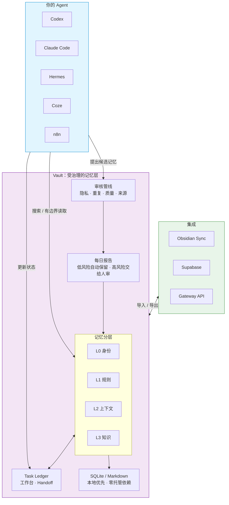

# Vault-for-LLM

[English](README.md) | [繁體中文](README.zh-Hant.md) | [简体中文](README.zh-CN.md)

给 AI Agent 用的记忆金库。

它让 Codex、Claude Code、Hermes、OpenClaw、n8n、Coze 等不同 Agent，
可以使用同一套项目记忆，而不是每次换工具就重新交代背景。

Vault 不是给完全没接触 Agent 的大众 app。它先服务已经在用
Codex、Claude Code、Hermes、OpenClaw、n8n、Coze 这类工具的 builder。

你仍然不需要先学一堆命令。最简单的用法是：把下面那段话贴给你的
Agent，让它帮你安装、设置、测试，之后你每天只看一份很短的记忆报告。

第一次看这个项目，可以先打开视觉 Demo：
[`docs/landing/index.html`](docs/landing/index.html)。

## 30 秒版

Vault-for-LLM 解决的不是“把更多东西塞进 AI”。

它解决的是：

- Agent 修过的 bug，下次不要再重踩。
- 项目决策有来源，不要散在聊天记录里。
- 多个 Agent 可以共享工作知识，但私人记忆不乱流。
- 新记忆先进入候选区，安全、低风险的才自动进入正式记忆。
- 不确定、敏感、冲突的内容，每天整理成报告让人确认。

一句话：

> Vault-for-LLM 不是让 Agent 什么都记住，而是让 Agent 可信地记、可审查地记、需要时能回滚。



### 为什么要用 Vault？

| 没有 Vault | 有 Vault |
|---|---|
| 每个 Agent 各记各的，同一个错误一直重演 | 一个共享记忆库，一次学到，多个 Agent 都能用 |
| 旧信息和新决策混在一起，Agent 不知道该信谁 | 有时间边界与过期机制，优先浮出最新可信内容 |
| 敏感信息到处流，没有审计与回滚 | 用治理 metadata 管 scope、sensitivity、owner、allowed agents |
| 记忆只是聊天记录堆，信号很难找 | 候选 → 审核 → 提升，只留下值得长期使用的记忆 |

核心流程：

```text
propose -> review -> promote -> search -> bounded read -> rollback -> audit
```

## 你是哪种用户？先从这里开始

| 角色 | 你在意的事 | 起点 |
|---|---|---|
| Agent 开发者 | 要怎么把 Vault 接进自己的 Agent？ | [MCP 记忆工作流](docs/mcp_memory_workflow.md) |
| 重度 Agent 用户 | 怎么让 Claude/Codex 不要一直忘？ | [5 分钟 Quickstart](docs/quickstart.md)，或直接复制下面的安装话术 |
| 团队协作 | 多个 Agent 怎么共享记忆但不失控？ | [三 Agent 共享记忆 runbook](docs/demo/three-agent-shared-memory-runbook.md) |
| Obsidian 用户 | 怎么让 Agent 安全使用我的笔记？ | [Obsidian](#obsidian) |
| 架构 / 技术负责人 | 这套东西可靠吗？边界在哪？ | [决策记录](docs/decision_records/) 与 [Search QA](docs/search_qa_benchmarking.md) |

## 最推荐：让 Agent 帮你安装

把这段贴给能执行本机命令的 Agent：

```text
帮这个项目安装 Vault-for-LLM。使用 vault-for-llm[mcp]==0.7.29。
请用 agent-assisted 的 governed-auto 记忆模式。

不要先显示进阶 CLI 参数。只问我四件事：
1. 我要用繁体中文、简体中文，还是英文？
2. 这个 Vault 是独立记忆库，还是给多个 Agent 共用？
3. 要不要连接 Obsidian 或 Supabase？
4. 每天几点给我记忆报告？

安装后请做一次 smoke check，并告诉我：
- Vault 放在哪里
- 每日记忆报告怎么看
- 本地 GUI 或下一步入口在哪里

日常规则：
安全、低风险、有来源的记忆可以自动保留；
不确定、敏感、冲突、策略性的记忆放进每日报告让我审核。
```

如果你是开发者，也可以手动执行：

```bash
python3 -m venv .venv
source .venv/bin/activate
pip install "vault-for-llm[mcp]==0.7.29"
vault quickstart
```

也可以让 Vault 打印可复制给 Agent 的安装话术：

```bash
vault guide --intent install
```

## 每天怎么用

已经在用 Agent 的 builder，不应该每天为了记忆库打命令。理想流程是：

1. Agent 工作时，会把“可能值得记住的事”提出来。
2. Vault 先检查隐私、重复、质量和来源。
3. 安全、低风险、有来源的记忆可以自动进入正式 Vault。
4. 需要你判断的内容，整理成每日记忆报告。
5. 你只看很少几张卡片：接受、拒绝、延后或保留两份。

每日报告应该回答三件事：

- 今天 Vault 帮我记住了什么？
- 有哪些记忆需要我看一眼？
- 有没有冲突、过期、敏感或不该长期保存的内容？

这就是 Vault 的核心路线：Agent 可以越来越会整理，但人保留最后的审核权。

## 适合谁

Vault-for-LLM 适合：

- 用 Codex、Claude Code、Hermes、OpenClaw、OpenCode、n8n 或 Coze 做项目的人。
- 希望多个 Agent 共用同一套项目记忆的人。
- 已经有 Markdown 或 Obsidian 笔记，希望 Agent 能查、能引用的人。
- 想把记忆留在自己手上，而不是一开始就交给云端的人。
- 想知道 Agent 到底根据哪份文件回答，而不是只相信它“好像记得”的人。

如果你只想要普通笔记软件、纯向量数据库，或完全黑盒的聊天记忆产品，
Vault-for-LLM 可能不是第一个该拿起来的工具。

如果你完全没有使用 Agent 的习惯，也不想让 Agent 帮你安装或管理工具，
Vault 现在还不是 app-store 式的一键产品。它目前最适合的是：已经踏入
Agent 工作流，但希望记忆不要分散、不要污染、不要失控的人。

## 它不是什么

它不是 Obsidian 替代品。

Obsidian 很适合人看笔记；Vault 让 Agent 能安全地使用那些笔记。

它不是单纯 RAG。

RAG 通常只管“查得到”。Vault 更在意“谁写的、能不能信、是否过期、谁能读、错了能不能回滚”。

它也不是聊天记录垃圾桶。

Vault 不鼓励把所有对话原封不动塞进长期记忆。它鼓励候选制、日报审核和低风险自动入库。

## 三个常见场景

### 1. 多个 Agent 共用项目记忆

Claude Code 修过一个测试流程，Codex 下一次可以查到；Hermes 可以看到已审核的决策；
OpenClaw 可以读共享 SOP，但不能读私人原始对话。

这是 Vault 最重要的方向：一个记忆库，多个 Agent 使用，各自有权限边界。

### 2. Obsidian 变成 Agent 可用的知识入口

你可以把既有 Obsidian 笔记导入 Vault，或让 Vault 把正式记忆导出成 Obsidian 可读格式。

目标不是把 Obsidian 变成数据库，而是让人的笔记和 Agent 的记忆能互相看见。

### 3. 多台机器或 hosted Agent 读共享记忆

本地 SQLite 仍是最简单、最可控的起点。

如果你需要跨主机共享，可以选 Supabase 或 Vault Gateway / Remote Server。
Vault 的设计方向是 adapter-first：同步层可以换，但统一记忆层要保持稳定。

## 一键安装

### macOS / Linux

```bash
curl -sSL https://raw.githubusercontent.com/zycaskevin/Vault-for-LLM/main/scripts/install.sh | bash
```

### Windows PowerShell

```powershell
irm https://raw.githubusercontent.com/zycaskevin/Vault-for-LLM/main/scripts/install.ps1 | iex
```

安装完成后，执行 `vault quickstart` 完成设置。

这两个 raw GitHub URL 需要等本 PR merge 到 `main` 后才会直接可用；
如果要按照正式版本文档走，请等 v0.7.30+。在此之前，可以使用本分支脚本，
或直接用上方的 Agent 安装话术。

来源：[`scripts/install.sh`](scripts/install.sh) · [`scripts/install.ps1`](scripts/install.ps1)

## 开发者快速开始

```bash
pip install "vault-for-llm[mcp]==0.7.29"

vault init ~/Vaults/demo
vault add "First lesson" \
  --content "The bug was caused by a missing cache key. The fix was adding provider metadata." \
  --project-dir ~/Vaults/demo
vault compile --project-dir ~/Vaults/demo --no-embed
vault search "cache key" --project-dir ~/Vaults/demo
vault --project-dir ~/Vaults/demo map build
vault --project-dir ~/Vaults/demo map read 1 --lines 1-20
```

需要 MCP：

```bash
vault-mcp --project-dir ~/Vaults/demo --tool-profile core
```

建议 Agent 一开始只开 core profile：

- `vault_search`
- `vault_read_range`
- `vault_memory_propose`
- `vault_stats`
- `vault_update_status`
- `vault_automation_handoff`

完整 MCP 文件：

- [MCP 工具参考](docs/mcp_tool_reference.md)
- [MCP 记忆工作流](docs/mcp_memory_workflow.md)

## 记忆分层

Vault 使用 L0-L3 表示记忆深度：

| Layer | 用途 |
|---|---|
| `L0` | 身份、项目定位、不可轻易改动的框架 |
| `L1` | 稳定事实、规则、偏好 |
| `L2` | 已审查的近期上下文、摘要、短中期背景 |
| `L3` | 详细知识、SOP、bug、决策、来源笔记 |

Task Ledger 不是 L2。它是任务进行中的工作台：blocker、下一步、证据链接与 handoff note。
只有经过审查后仍值得保留的教训、决策与摘要，才提升到 L2/L3。

权限不要只靠 layer 判断，还要搭配：

- `scope`: private, project, shared, public
- `sensitivity`: low, medium, high, restricted
- `owner_agent`
- `allowed_agents`
- `memory_type`
- `expires_at`
- `valid_from` / `valid_until`

详细设计：[memory_governance.md](docs/memory_governance.md)。

## Obsidian

导入既有 Obsidian vault：

```bash
vault import obsidian --vault ~/Documents/ObsidianVault --project-dir ~/Vaults/my-project --dry-run
vault import obsidian --vault ~/Documents/ObsidianVault --project-dir ~/Vaults/my-project --compile
```

导出 Vault 知识给 Obsidian 阅读：

```bash
vault export obsidian --project-dir ~/Vaults/my-project --vault ~/Documents/ObsidianVault
```

Obsidian conflict inbox 会用明确选项处理冲突：接受 Obsidian、接受 Vault、或保留两份。

## Supabase 与远端共享

SQLite 仍然是最简单的 source of truth。Supabase 是可选共享层，适合不同主机、
n8n、Coze 或 hosted Agent 读共享记忆。

```bash
pip install "vault-for-llm[supabase]==0.7.29"
python -m scripts.sync_to_supabase --db ~/Vaults/my-project/vault.db --document-map --health
```

设置指南：

- [Supabase 设置](docs/supabase_setup.md)
- [Supabase read policy SQL](docs/supabase_read_policy.sql)

## 进阶功能索引

- 核心概念白话版：[docs/core-concepts.md](docs/core-concepts.md)
- Agent 安装：[docs/agent_install.md](docs/agent_install.md)
- Agent 整合：[docs/agent_integrations.md](docs/agent_integrations.md)
- 自动化与每日报告：[docs/automation.md](docs/automation.md)
- 记忆治理：[docs/memory_governance.md](docs/memory_governance.md)
- Gateway / Remote 架构：[docs/decision_records/2026-07-02-vault-remote-gateway-contract.md](docs/decision_records/2026-07-02-vault-remote-gateway-contract.md)
- Obsidian-as-GUI：[docs/decision_records/2026-07-01-obsidian-as-human-gui.md](docs/decision_records/2026-07-01-obsidian-as-human-gui.md)
- Search QA：[docs/search_qa_benchmarking.md](docs/search_qa_benchmarking.md)
- OKF 导入导出：[docs/okf_integration.md](docs/okf_integration.md)

## 成熟度

| 功能 | 状态 |
|---|---|
| Local SQLite vault | 稳定 |
| CLI / MCP 搜索与 bounded read | 稳定 |
| Consumer guided setup / governed-auto | 稳定成长中 |
| Obsidian 导入/导出/冲突审核 | 可用，仍在打磨同步体验 |
| Supabase / Gateway remote sharing | 可用，部署时要注意权限与传输安全 |
| Semantic embedding / reranker | 可选，需要额外依赖 |

## 开发与测试

```bash
python -m venv .venv
source .venv/bin/activate
pip install -e ".[dev,mcp]"
pytest -q
```

## 授权

Apache-2.0
