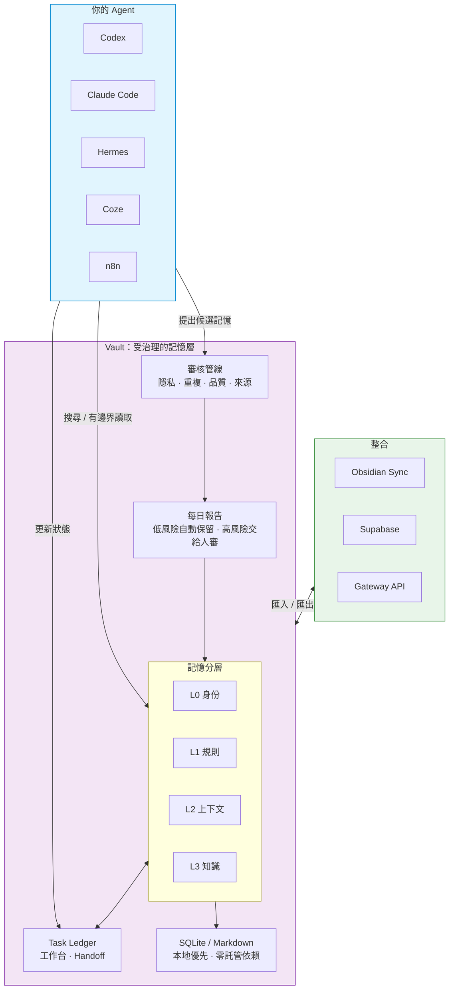

# Vault-for-LLM

[English](README.md) | [繁體中文](README.zh-Hant.md) | [简体中文](README.zh-CN.md)

給 AI Agent 用的記憶金庫。

它讓 Codex、Claude Code、Hermes、OpenClaw、n8n、Coze 等不同 Agent，
可以使用同一套專案記憶，而不是每次換工具就重新交代背景。

Vault 不是給完全沒接觸 Agent 的大眾 app。它先服務已經在用
Codex、Claude Code、Hermes、OpenClaw、n8n、Coze 這類工具的 builder。

你仍然不需要先學一堆指令。最簡單的用法是：把下面那段話貼給你的
Agent，讓它幫你安裝、設定、測試，之後你每天只看一份很短的記憶報告。

第一次看這個專案，可以先打開視覺 Demo：
[`docs/landing/index.html`](docs/landing/index.html)。

## 30 秒版

Vault-for-LLM 解決的不是「把更多東西塞進 AI」。

它解決的是：

- Agent 修過的 bug，下次不要再重踩。
- 專案決策有來源，不要散在聊天紀錄裡。
- 多個 Agent 可以共享工作知識，但私人記憶不亂流。
- 新記憶先進候選區，安全、低風險的才自動進正式記憶。
- 不確定、敏感、衝突的內容，每天整理成報告讓人確認。

一句話：

> Vault-for-LLM 不是讓 Agent 什麼都記住，而是讓 Agent 可信地記、可審核地記、需要時能回滾。



### 為什麼要用 Vault？

| 沒有 Vault | 有 Vault |
|---|---|
| 每個 Agent 各記各的，同一個錯誤一直重演 | 一個共享記憶庫，一次學到，多個 Agent 都能用 |
| 舊資訊和新決策混在一起，Agent 不知道該信誰 | 有時間邊界與過期機制，優先浮出最新可信內容 |
| 敏感資訊到處流，沒有審計與回滾 | 用治理 metadata 管 scope、sensitivity、owner、allowed agents |
| 記憶只是聊天紀錄堆，訊號很難找 | 候選 → 審核 → 提升，只留下值得長期使用的記憶 |

核心流程：

```text
propose -> review -> promote -> search -> bounded read -> rollback -> audit
```

## 你是哪種使用者？先從這裡開始

| 角色 | 你在意的事 | 起點 |
|---|---|---|
| Agent 開發者 | 要怎麼把 Vault 接進自己的 Agent？ | [MCP 記憶工作流](docs/mcp_memory_workflow.md) |
| 重度 Agent 使用者 | 怎麼讓 Claude/Codex 不要一直忘？ | [5 分鐘 Quickstart](docs/quickstart.md)，或直接複製下面的安裝話術 |
| 團隊協作 | 多個 Agent 怎麼共享記憶但不失控？ | [三 Agent 共享記憶 runbook](docs/demo/three-agent-shared-memory-runbook.md) |
| Obsidian 使用者 | 怎麼讓 Agent 安全使用我的筆記？ | [Obsidian](#obsidian) |
| 架構 / 技術負責人 | 這套東西可靠嗎？邊界在哪？ | [決策紀錄](docs/decision_records/) 與 [Search QA](docs/search_qa_benchmarking.md) |

## 最推薦：讓 Agent 幫你安裝

把這段貼給能執行本機指令的 Agent：

```text
幫這個專案安裝 Vault-for-LLM。使用 vault-for-llm[mcp]==0.7.29。
請用 agent-assisted 的 governed-auto 記憶模式。

不要先顯示進階 CLI 參數。只問我四件事：
1. 我要用繁體中文、簡體中文，還是英文？
2. 這個 Vault 是獨立記憶庫，還是給多個 Agent 共用？
3. 要不要連接 Obsidian 或 Supabase？
4. 每天幾點給我記憶報告？

安裝後請做一次 smoke check，並告訴我：
- Vault 放在哪裡
- 每日記憶報告怎麼看
- 本機 GUI 或下一步入口在哪裡

日常規則：
安全、低風險、有來源的記憶可以自動保留；
不確定、敏感、衝突、策略性的記憶放進每日報告讓我審核。
```

如果你是開發者，也可以手動執行：

```bash
python3 -m venv .venv
source .venv/bin/activate
pip install "vault-for-llm[mcp]==0.7.29"
vault quickstart
```

也可以讓 Vault 印出可複製給 Agent 的安裝話術：

```bash
vault guide --intent install
```

## 每天怎麼用

已經在用 Agent 的 builder，不應該每天為了記憶庫打指令。理想流程是：

1. Agent 工作時，會把「可能值得記住的事」提出來。
2. Vault 先檢查隱私、重複、品質和來源。
3. 安全、低風險、有來源的記憶可以自動進正式 Vault。
4. 需要你判斷的內容，整理成每日記憶報告。
5. 你只看很少幾張卡片：接受、拒絕、延後或保留兩份。

每天報告應該回答三件事：

- 今天 Vault 幫我記住了什麼？
- 有哪些記憶需要我看一眼？
- 有沒有衝突、過期、敏感或不該長期保存的內容？

這就是 Vault 的核心路線：Agent 可以越來越會整理，但人保留最後的審核權。

## 適合誰

Vault-for-LLM 適合：

- 用 Codex、Claude Code、Hermes、OpenClaw、OpenCode、n8n 或 Coze 做專案的人。
- 希望多個 Agent 共用同一套專案記憶的人。
- 已經有 Markdown 或 Obsidian 筆記，希望 Agent 能查、能引用的人。
- 想把記憶留在自己手上，而不是一開始就交給雲端的人。
- 想知道 Agent 到底根據哪份文件回答，而不是只相信它「好像記得」的人。

如果你只想要普通筆記軟體、純向量資料庫，或完全黑盒的聊天記憶產品，
Vault-for-LLM 可能不是第一個該拿起來的工具。

如果你完全沒有使用 Agent 的習慣，也不想讓 Agent 幫你安裝或管理工具，
Vault 現在還不是 app-store 式的一鍵產品。它目前最適合的是：已經踏入
Agent 工作流，但希望記憶不要分散、不要污染、不要失控的人。

## 它不是什麼

它不是 Obsidian 替代品。

Obsidian 很適合人看筆記；Vault 讓 Agent 能安全地使用那些筆記。

它不是單純 RAG。

RAG 通常只管「查得到」。Vault 更在意「誰寫的、能不能信、是否過期、誰能讀、錯了能不能回滾」。

它也不是聊天紀錄垃圾桶。

Vault 不鼓勵把所有對話原封不動塞進長期記憶。它鼓勵候選制、日報審核和低風險自動入庫。

## 三個常見情境

### 1. 多個 Agent 共用專案記憶

Claude Code 修過一個測試流程，Codex 下一次可以查到；Hermes 可以看到已審核的決策；
OpenClaw 可以讀共享 SOP，但不能讀私人原始對話。

這是 Vault 最重要的方向：一個記憶庫，多個 Agent 使用，各自有權限邊界。

### 2. Obsidian 變成 Agent 可用的知識入口

你可以把既有 Obsidian 筆記匯入 Vault，或讓 Vault 把正式記憶匯出成 Obsidian 可讀格式。

目標不是把 Obsidian 變成資料庫，而是讓人的筆記和 Agent 的記憶能互相看見。

### 3. 多台機器或 hosted Agent 讀共享記憶

本機 SQLite 仍是最簡單、最可控的起點。

如果你需要跨主機共享，可以選 Supabase 或 Vault Gateway / Remote Server。
Vault 的設計方向是 adapter-first：同步層可以換，但統一記憶層要保持穩定。

## 一鍵安裝

### macOS / Linux

```bash
curl -sSL https://raw.githubusercontent.com/zycaskevin/Vault-for-LLM/main/scripts/install.sh | bash
```

### Windows PowerShell

```powershell
irm https://raw.githubusercontent.com/zycaskevin/Vault-for-LLM/main/scripts/install.ps1 | iex
```

安裝完成後，執行 `vault quickstart` 完成設定。

這兩個 raw GitHub URL 已經可以從 `main` 使用，並會安裝本 README 固定的
release 版本。如果你想完全依照 release-tagged 文件走，請使用包含這兩支
安裝腳本的下一個正式版本文件。

來源：[`scripts/install.sh`](scripts/install.sh) · [`scripts/install.ps1`](scripts/install.ps1)

## 開發者快速開始

```bash
pip install "vault-for-llm[mcp]==0.7.29"

vault init ~/Vaults/demo
vault add "First lesson" \
  --content "The bug was caused by a missing cache key. The fix was adding provider metadata." \
  --project-dir ~/Vaults/demo
vault compile --project-dir ~/Vaults/demo --no-embed
vault search "cache key" --project-dir ~/Vaults/demo
vault --project-dir ~/Vaults/demo map build
vault --project-dir ~/Vaults/demo map read 1 --lines 1-20
```

需要 MCP：

```bash
vault-mcp --project-dir ~/Vaults/demo --tool-profile core
```

建議 Agent 一開始只開 core profile：

- `vault_search`
- `vault_read_range`
- `vault_memory_propose`
- `vault_stats`
- `vault_update_status`
- `vault_automation_handoff`

完整 MCP 文件：

- [MCP 工具參考](docs/mcp_tool_reference.md)
- [MCP 記憶工作流](docs/mcp_memory_workflow.md)

## 記憶分層

Vault 使用 L0-L3 表示記憶深度：

| Layer | 用途 |
|---|---|
| `L0` | 身份、專案定位、不可輕易改動的框架 |
| `L1` | 穩定事實、規則、偏好 |
| `L2` | 已審查的近期上下文、摘要、短中期背景 |
| `L3` | 詳細知識、SOP、bug、決策、來源筆記 |

Task Ledger 不是 L2。它是任務進行中的工作台：blocker、下一步、證據連結與 handoff note。
只有經過審查後仍值得保留的教訓、決策與摘要，才提升到 L2/L3。

權限不要只靠 layer 判斷，還要搭配：

- `scope`: private, project, shared, public
- `sensitivity`: low, medium, high, restricted
- `owner_agent`
- `allowed_agents`
- `memory_type`
- `expires_at`
- `valid_from` / `valid_until`

詳細設計：[memory_governance.md](docs/memory_governance.md)。

## Obsidian

匯入既有 Obsidian vault：

```bash
vault import obsidian --vault ~/Documents/ObsidianVault --project-dir ~/Vaults/my-project --dry-run
vault import obsidian --vault ~/Documents/ObsidianVault --project-dir ~/Vaults/my-project --compile
```

匯出 Vault 知識給 Obsidian 閱讀：

```bash
vault export obsidian --project-dir ~/Vaults/my-project --vault ~/Documents/ObsidianVault
```

Obsidian conflict inbox 會用明確選項處理衝突：接受 Obsidian、接受 Vault、或保留兩份。

## Supabase 與遠端共享

SQLite 仍然是最簡單的 source of truth。Supabase 是可選共享層，適合不同主機、
n8n、Coze 或 hosted Agent 讀共享記憶。

```bash
pip install "vault-for-llm[supabase]==0.7.29"
python -m scripts.sync_to_supabase --db ~/Vaults/my-project/vault.db --document-map --health
```

設定指南：

- [Supabase 設定](docs/supabase_setup.md)
- [Supabase read policy SQL](docs/supabase_read_policy.sql)

## 進階功能索引

- 核心概念白話版：[docs/core-concepts.md](docs/core-concepts.md)
- Agent 安裝：[docs/agent_install.md](docs/agent_install.md)
- Agent 整合：[docs/agent_integrations.md](docs/agent_integrations.md)
- 自動化與每日報告：[docs/automation.md](docs/automation.md)
- 記憶治理：[docs/memory_governance.md](docs/memory_governance.md)
- Gateway / Remote 架構：[docs/decision_records/2026-07-02-vault-remote-gateway-contract.md](docs/decision_records/2026-07-02-vault-remote-gateway-contract.md)
- Obsidian-as-GUI：[docs/decision_records/2026-07-01-obsidian-as-human-gui.md](docs/decision_records/2026-07-01-obsidian-as-human-gui.md)
- Search QA：[docs/search_qa_benchmarking.md](docs/search_qa_benchmarking.md)
- OKF 匯入匯出：[docs/okf_integration.md](docs/okf_integration.md)

## 成熟度

| 功能 | 狀態 |
|---|---|
| Local SQLite vault | 穩定 |
| CLI / MCP 搜尋與 bounded read | 穩定 |
| Consumer guided setup / governed-auto | 穩定成長中 |
| Obsidian 匯入/匯出/衝突審核 | 可用，仍在打磨同步體驗 |
| Supabase / Gateway remote sharing | 可用，部署時要注意權限與傳輸安全 |
| Semantic embedding / reranker | 可選，需要額外依賴 |

## 開發與測試

```bash
python -m venv .venv
source .venv/bin/activate
pip install -e ".[dev,mcp]"
pytest -q
```

## 授權

Apache-2.0
